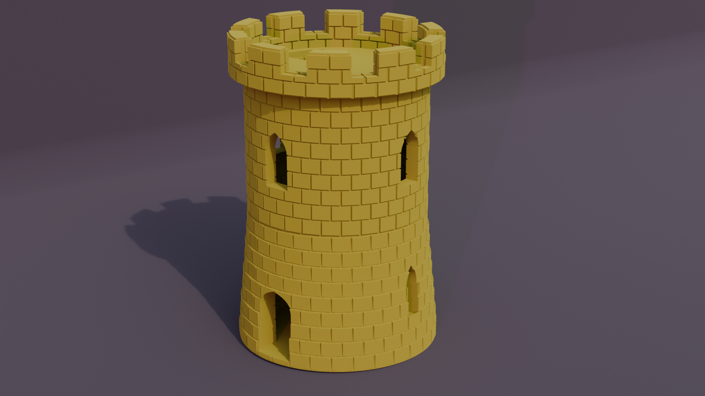

# cqfantasy
Python library for making 3d printable Fantasy terrain using cadquery.

<br /><br />

``` python
import cadquery as cq
from cqfantasy.tower import Tower, LatticeWindow

bp_tower = Tower()
bp_tower.base_bp.render_blocks = True
bp_tower.mid_bp.render_blocks = True
bp_tower.mid_bp.bp_window = LatticeWindow()
bp_tower.top_bp.render_blocks = True
bp_tower.make()
ex = bp_tower.build()
show_object(ex)
```

* [Example](./example/tower/tower_example.py)
* [stl](./stl/tower_example.stl)

---

## Project Documention
* [Documentation](documentation/documentation.md)
    * [Arch](documentation/arch.md)
    * [Door](documentation/door.md)
    * [House](documentation/house.md)
    * [House Wall](documentation/house_wall.md)
	* [Tower](documentation/tower.md)
    * [Wall](documentation/wall.md)

## Changes
* [Changelog](./changes.md)

## Dependencies
* [CadQuery 2.x](https://github.com/CadQuery/cadquery)
* [cqterrain](https://github.com/medicationforall/cqterrain)

---

### Installation
To install cqfantasy directly from GitHub, run the following `pip` command:

	pip install git+https://github.com/medicationforall/cqfantasy

**OR**

### Local Installation
From the cloned cqfantasy directory run.

	pip install ./

---

## Running Example Scripts
[example_runner.py](example_runner.py) runs all examples.

``` bash
C:\Users\<user>\home\3d\cqfantasy>python example_runner.py
```

**OR**

### Running individual examples
* From the root of the project run one of the example scripts:
  
``` bash
C:\Users\<user>\home\3d\cqfantasy>python ./example/tower/tower_example.py
```
