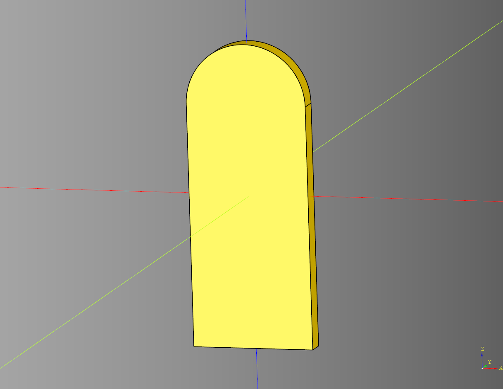
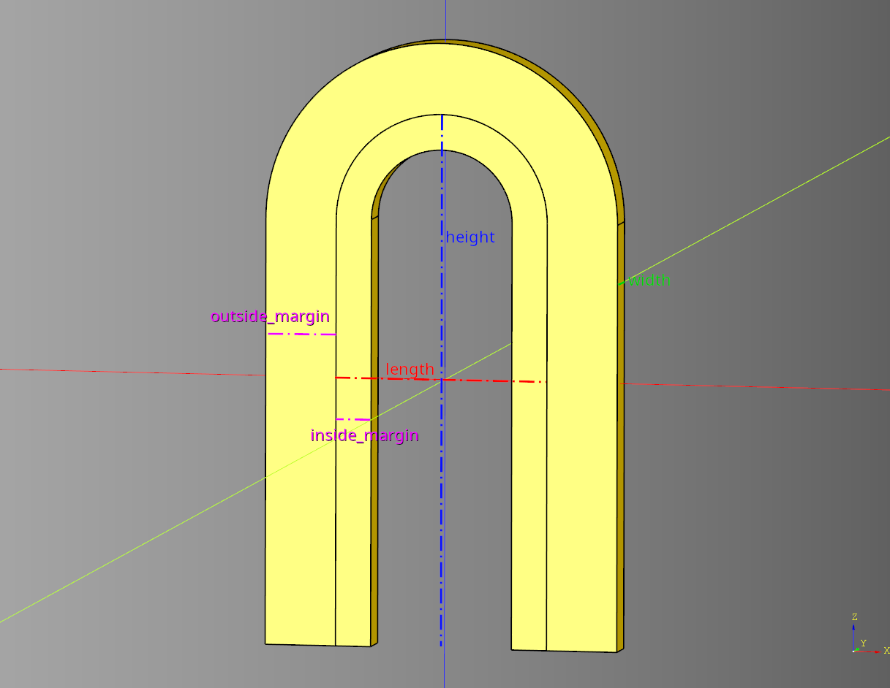
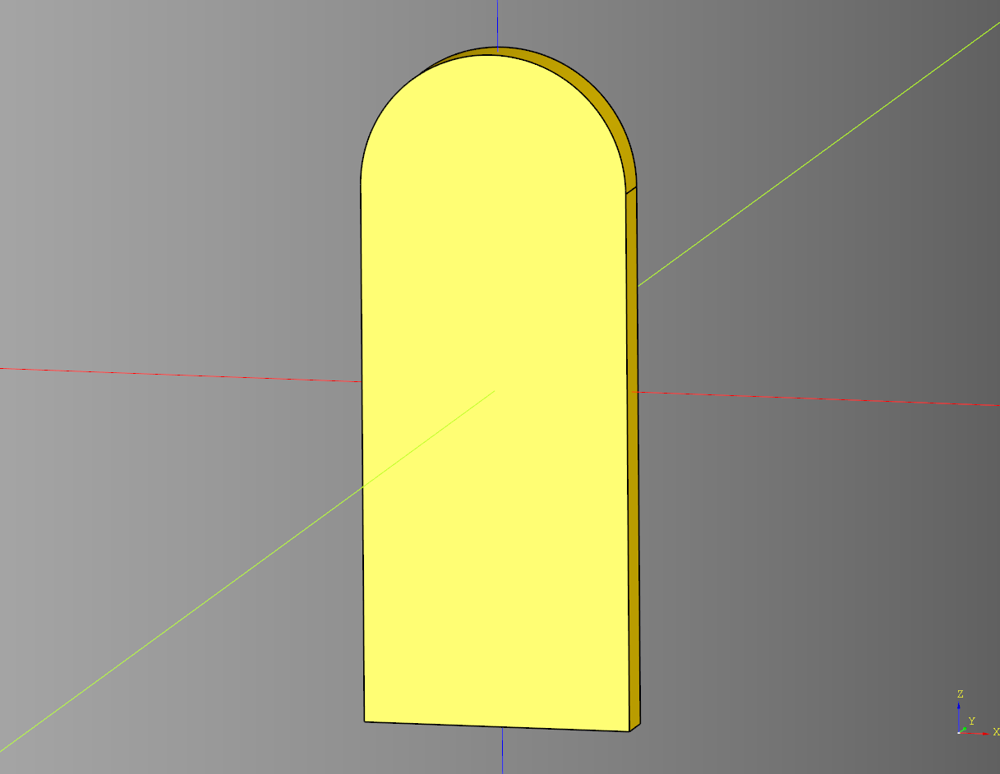
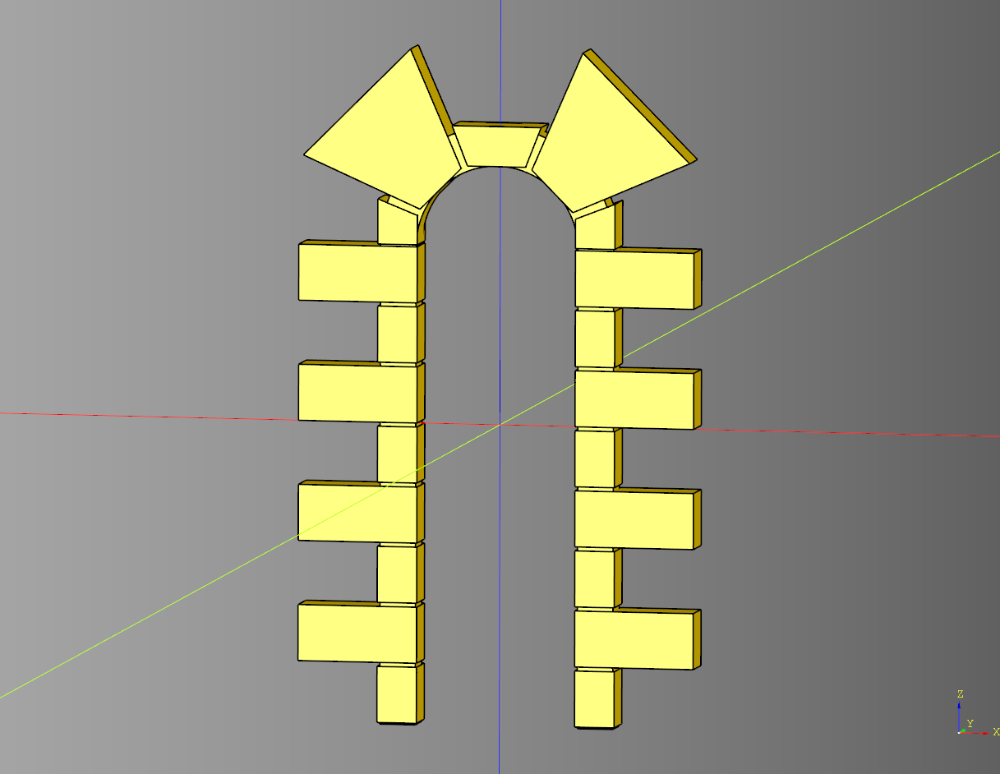

# Arch Documentation

## Arch
Utility method for creating an arch.
Note with this implementation of the arch length cannot be greater than height.

### parameters
* length: float 
* width: float 
* height: float

``` python
import cadquery as cq
from cqfantasy.arch import arch

ex_arch = arch(
    length=30, 
    width=5, 
    height=75
)

show_object(ex_arch)
```



* [source](../src/cqfantasy/arch/Arch.py)
* [example](../example/arch/arch.py)
* [stl](../stl/arch_arch.stl)

## BasicArch
Basic outline of an arch that inherits from cadqueryhelper [Base](https://github.com/medicationforall/cadqueryhelper/blob/main/src/cadqueryhelper/Base.py).

### parameters
* length: float
* width: float
* height: float
* outside_margin: float
* inside_margin: float

``` python
import cadquery as cq
from cqfantasy.arch import BasicArch

bp_arch = BasicArch()

bp_arch.length = 30
bp_arch.width = 5
bp_arch.height = 75
bp_arch.outside_margin = 10
bp_arch.inside_margin = 5

bp_arch.make()
ex_arch = bp_arch.build()

show_object(ex_arch)
```



### Build outline example
Outline view of the basic arch. This is useful for making cut outs to place the shape.

``` python
import cadquery as cq
from cqfantasy.arch import BasicArch

bp_arch = BasicArch()

bp_arch.length = 30
bp_arch.width = 5
bp_arch.height = 75
bp_arch.outside_margin = 10
bp_arch.inside_margin = 5

bp_arch.make()
ex_arch = bp_arch.build_outline()

show_object(ex_arch)
```



* [source](../src/cqfantasy/arch/BasicArch.py)
* [example](../example/arch/basic_arch.py)
* [stl](../stl/arch_basic_arch.stl)

## StoneArch
Implementation of a stone arch that inherits from [BasicArch](#basicarch).

### parameters
* stone_count: int
* stone_arch_count: int
* stone_margin: float
* width_margin: float
* stone_modulus: int
* outside_stone_position: int
* stone_arch_modulus: int
* outside_stone_arch_position: int

``` python
import cadquery as cq
from cqfantasy.arch import StoneArch

bp_arch = StoneArch()

# basic arch parameters
bp_arch.length = 30
bp_arch.width = 5
bp_arch.height = 75
bp_arch.outside_margin = 10
bp_arch.inside_margin = 5

# stone arch parameters
bp_arch.stone_count = 8
bp_arch.stone_arch_count = 4
bp_arch.stone_margin = .5
bp_arch.width_margin = .5
bp_arch.stone_modulus = 2
bp_arch.outside_stone_position = 0
bp_arch.stone_arch_modulus = 2
bp_arch.outside_stone_arch_position = 1

bp_arch.make()
ex_arch = bp_arch.build()

show_object(ex_arch)
```



* [source](../src/cqfantasy/arch/StoneArch.py)
* [example](../example/arch/stone_arch.py)
* [stl](../stl/arch_stone_arch.stl)