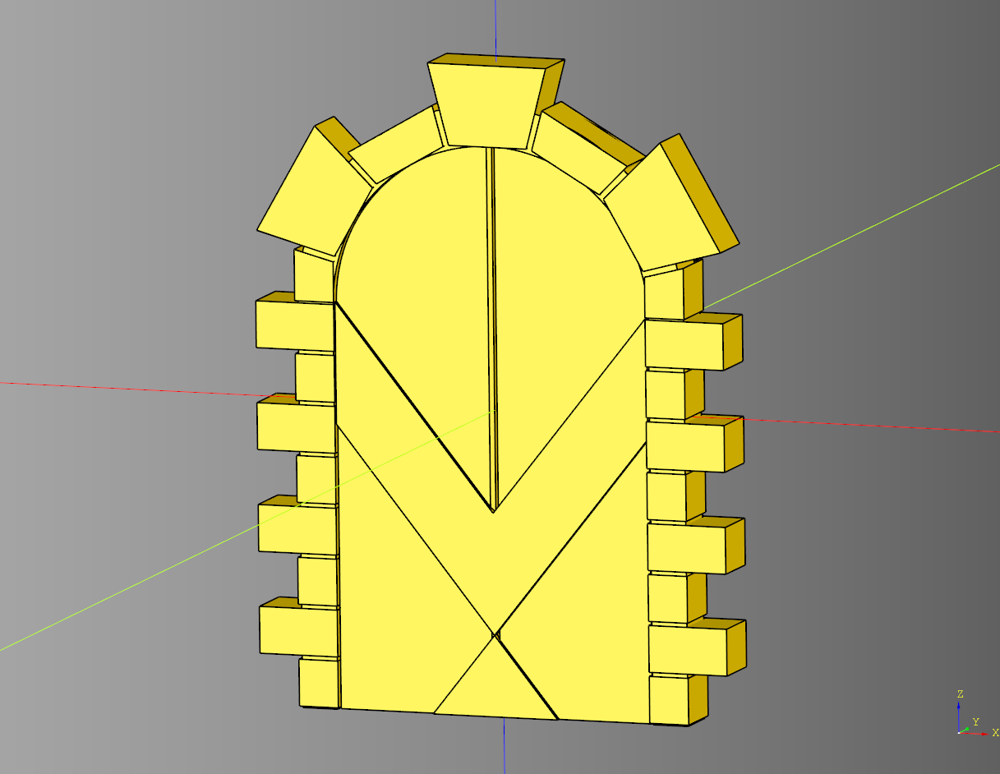
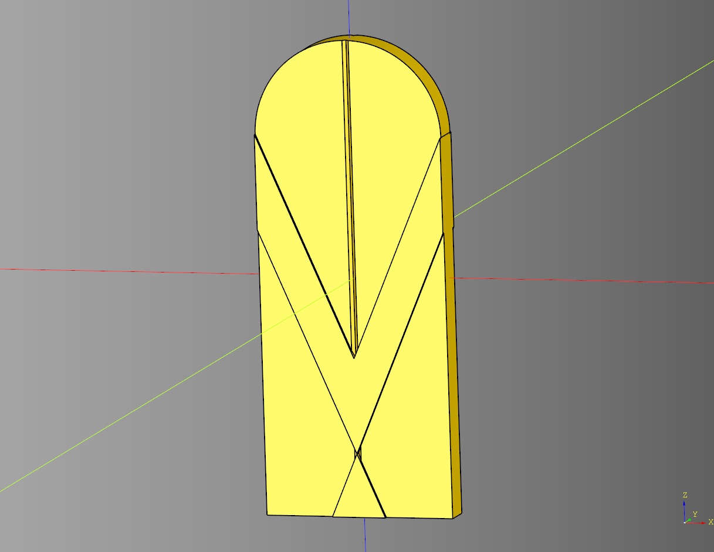

# Door Documentation

## Arch Door
Door and arch code inherits from [Base](https://github.com/medicationforall/cadqueryhelper/blob/main/src/cadqueryhelper/Base.py) class.

### parameters
* length: float
* width: float
* height: float
* door_inset: float

### blueprints
* bp_arch = [StoneArch](./arch.md#stonearch)()
* bp_door = [VDoor](#v-door)()

``` python
import cadquery as cq
from cqfantasy.door import ArchDoor

bp_door = ArchDoor()

bp_door.length = 50
bp_door.width = 7
bp_door.height = 75
bp_door.door_inset = 2

bp_door.make()
ex_door = bp_door.build()

show_object(ex_door)
```



* [source](../src/cqfantasy/door/ArchDoor.py)
* [example](../example/door/arch_door.py)
* [stl](../stl/door_arch_door.stl)


## V Door
Styled door inherits from [Base](https://github.com/medicationforall/cadqueryhelper/blob/main/src/cadqueryhelper/Base.py) class.

### parameters
* length:float
* width:float 
* height:float
* v_margin:float
* v_width:float
* v_intersect:float
* door_chamfer:float

``` python
import cadquery as cq
from cqfantasy.door import VDoor

bp_door = VDoor()

bp_door.length = 30
bp_door.width = 5
bp_door.height = 75

bp_door.v_margin = 1
bp_door.v_width = 15
bp_door.v_intersect = 10

bp_door.door_chamfer = 0.5

bp_door.make()

door_ex = bp_door.build()

show_object(door_ex)
```



* [source](../src/cqfantasy/door/VDoor.py)
* [example](../example/door/v_door.py)
* [stl](../stl/door_v_door.stl)