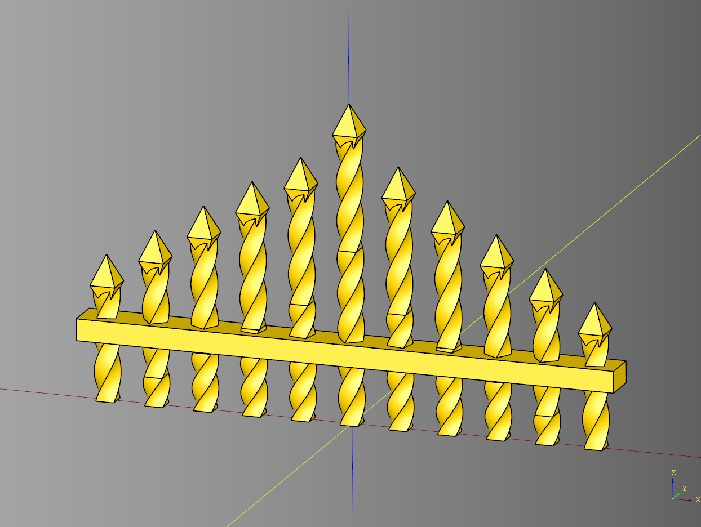
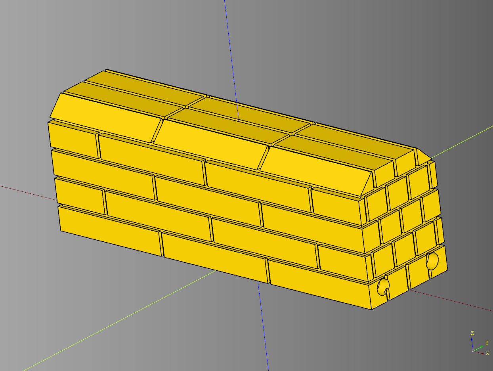
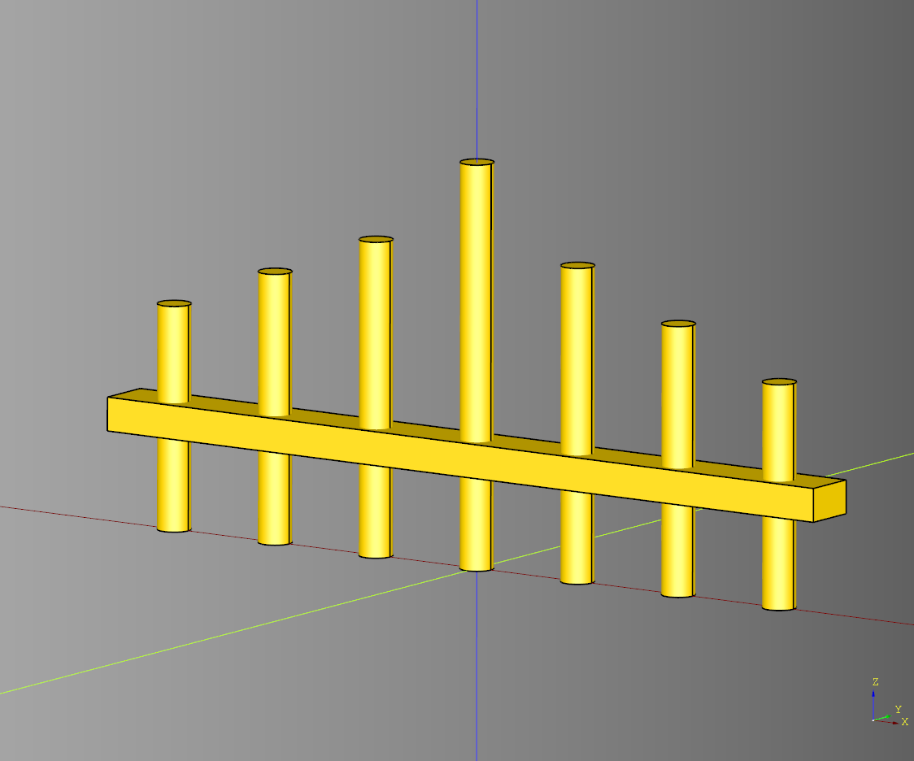
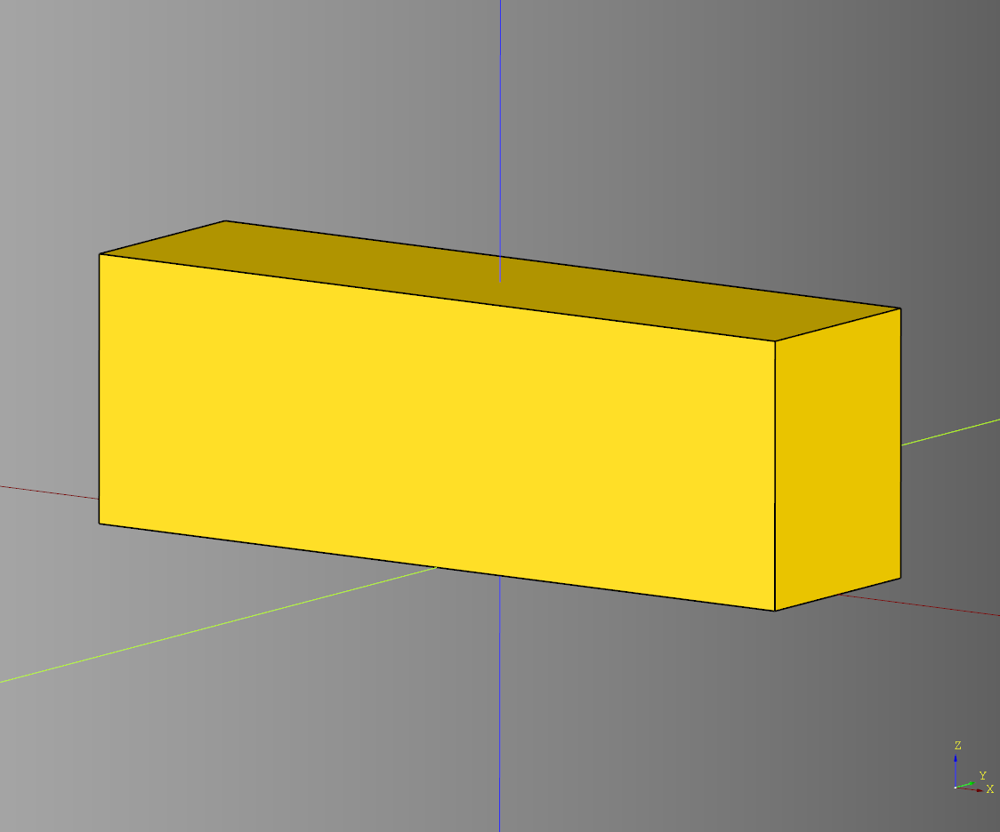
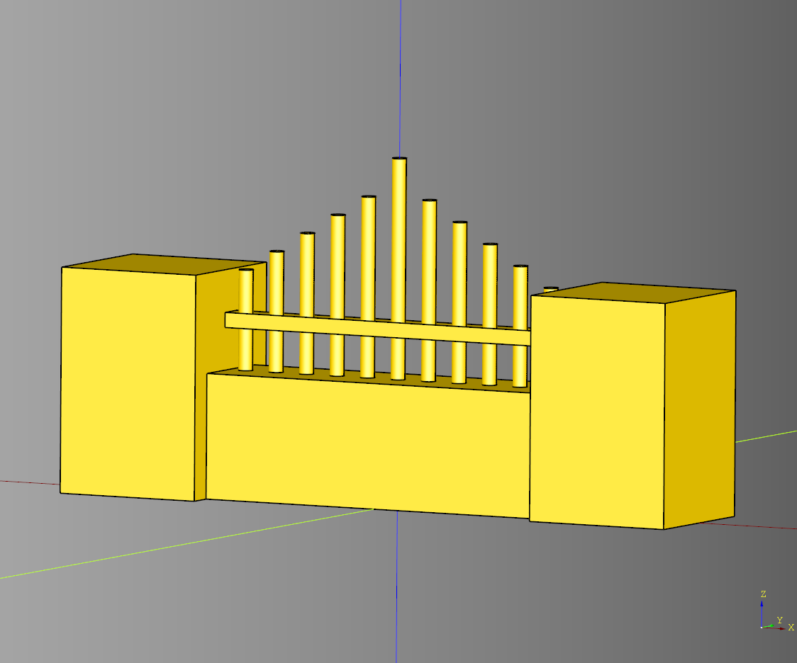
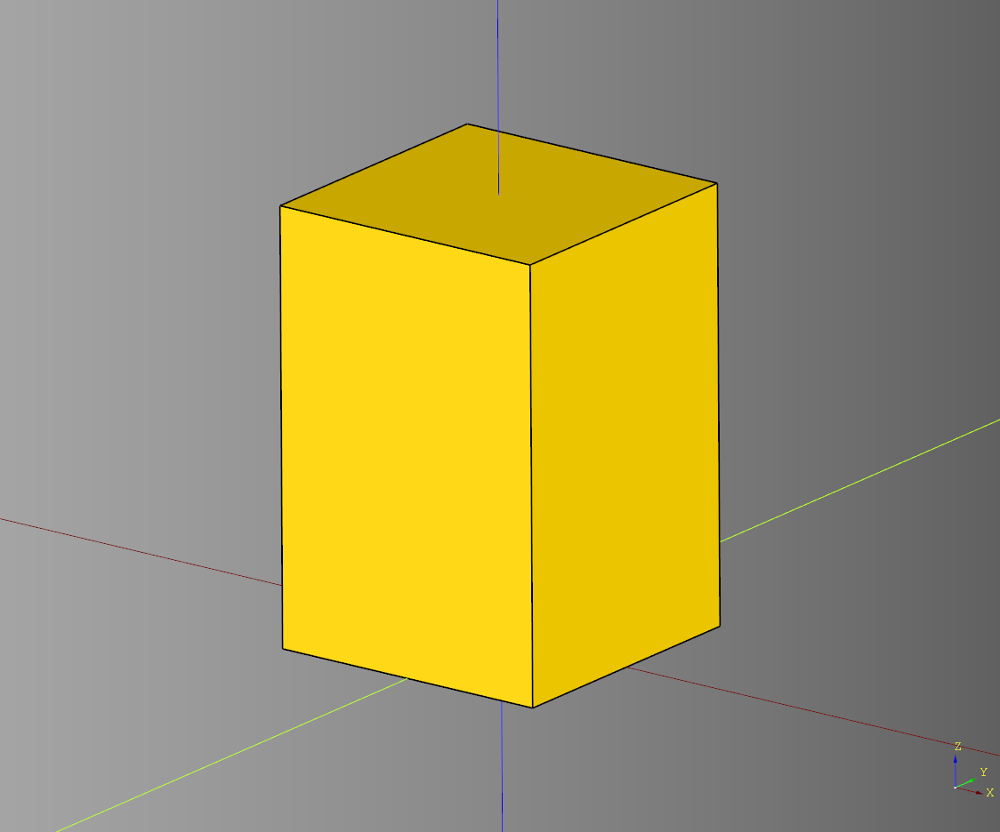
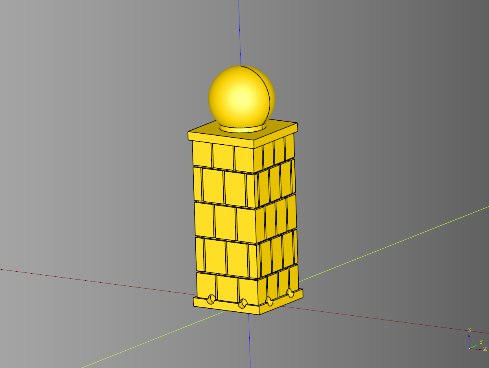

# Fence

---

## Bar Greebled
Builder class inherits off of [BasicBarDecoration](#basic-bar-decoration)

### Parameters
* length: float
* width: float
* height: float
* bar_height: float
* bar_z_translate: float|None
* spike_count: int
* spike_lift: float
* spike_diameter: float
* top_length: float
* top_width: float
* top_height: float

``` python
import cadquery as cq
from cqfantasy.fence import BarGreebled

bp_bar = BarGreebled()
bp_bar.length = 75
bp_bar.width = 5
bp_bar.height = 20

bp_bar.bar_height = 3
bp_bar.bar_z_translate = None
bp_bar.spike_count = 11
bp_bar.spike_lift = 4
bp_bar.spike_diameter = 2.5

bp_bar.top_length = 3.5
bp_bar.top_width = 3.5
bp_bar.top_height = 4
bp_bar.make()

ex_bar = bp_bar.build()

show_object(ex_bar)
```


* [source](../src/cqfantasy/fence/BarGreebled.py)
* [example](../example/fence/bar_greebled.py)
* [stl](../stl/fence_bar_greebled.stl)

## Base Brick
### parameters
* length: float
* width: float
* height: float
* inner_padding: float
* chamfer: float|None
* render_magnets: bool
* magnet_padding: float
* magnet_padding_x: float
* base_height:float - used for adusting magnet placement

### blueprints
* bp_bricks
* magnets_bp

``` python
import cadquery as cq
from cqfantasy.fence import BaseBrick

bp_base = BaseBrick()
bp_base.length = 75
bp_base.width = 20
bp_base.height = 25
bp_base.inner_padding = .6
bp_base.chamfer = 4

bp_base.render_magnets = True
bp_base.magnet_padding = 1
bp_base.magnet_padding_x = 2
bp_base.base_height = 5.6
bp_base.make()

ex_base = bp_base.build()

show_object(ex_base)
```



* [source](../src/cqfantasy/fence/BaseBrick.py)
* [example](../example/fence/base_brick.py)
* [stl](../stl/fence_base_brick.stl)


## Basic Bar Decoration

### parameters
* length: float
* width: float
* height: float - Initial height of the bars
* bar_height: float
* bar_z_translate: float|None - If None the bar is place based on half the height
* spike_count: int
* spike_lift: float
* spike_diameter: float

``` python
import cadquery as cq
from cqfantasy.fence import BasicBarDecoration

bp_spikes= BasicBarDecoration()
bp_spikes.length = 75
bp_spikes.width = 5
bp_spikes.height = 20

bp_spikes.bar_height = 3
bp_spikes.bar_z_translate = None
bp_spikes.spike_count = 7
bp_spikes.spike_lift = 4
bp_spikes.spike_diameter = 3

bp_spikes.make()

ex_spikes = bp_spikes.build()
ex_outline= bp_spikes.build_outline()

show_object(ex_spikes)
show_object(ex_outline.translate((0,5,0)))
```



* [source](../src/cqfantasy/fence/BasicBarDecoration.py)
* [example](../example/fence/basic_bar_decoration.py)
* [stl](../stl/fence_basic_bar_decoration.stl)

---

## Basic Base
Stub class, extend and replace

### parameters
* length:float
* width:float
* height:float

``` python
import cadquery as cq
from cqfantasy.fence import BasicBase

bp_base = BasicBase()
bp_base.length = 75
bp_base.width = 20
bp_base.height = 25
bp_base.make()

ex_base = bp_base.build()

show_object(ex_base)
```



* [source](../src/cqfantasy/fence/BasicBase.py)
* [example](../example/fence/basic_base.py)
* [stl](../stl/fence_basic_base.stl)

---

## Basic Fence
Orchestrator class

### blueprints
* bp_base = BasicBase()
* bp_pillar = BasicPillar()
* bp_bars = BasicBarDecoration()

``` python
import cadquery as cq
from cqfantasy.fence import BasicFence

bp_fence = BasicFence()
bp_fence.make()

ex_fence = bp_fence.build()

show_object(ex_fence)
```



* [source](../src/cqfantasy/fence/BasicFence.py)
* [example](../example/fence/basic_fence.py)
* [stl](../stl/fence_basic_fence.stl)

---

## Basic Pillar
Stub class, extend and replace

### parameters
* length:float
* width:float
* height:float

``` python
import cadquery as cq
from cqfantasy.fence import BasicPillar

bp_pillar = BasicPillar()
bp_pillar.length = 30
bp_pillar.width = 30
bp_pillar.height = 45
bp_pillar.make()

ex_pillar = bp_pillar.build()

show_object(ex_pillar)
```



* [source](../src/cqfantasy/fence/BasicPillar.py)
* [example](../example/fence/basic_pillar.py)
* [stl](../stl/fence_basic_pillar.stl)

---


## Pillar Brick

### parameters
* length: float
* width: float
* height: float
* inner_padding: float
* cap_width: float
* cap_length: float
* cap_height: float
* sphere_diameter: float
* cylinder_height: float
* cylinder_diameter: float
* render_magnets: bool
* magnet_padding: float
* magnet_padding_x: float
* base_height: float - used for adusting magnet placement
* magnet_width: float - used for adusting magnet placement

### blueprints
* bp_bricks
* magnets_bp

``` python
import cadquery as cq
from cqfantasy.fence import PillarBrick

bp_pillar = PillarBrick()
bp_pillar.length = 25
bp_pillar.width = 25
bp_pillar.height = 60
bp_pillar.inner_padding = 1

bp_pillar.cap_width = 27
bp_pillar.cap_length = 27
bp_pillar.cap_height = 3

bp_pillar.sphere_diameter = 23
bp_pillar.cylinder_height = 3
bp_pillar.cylinder_diameter = 16

bp_pillar.render_magnets = True
bp_pillar.magnet_padding = 1
bp_pillar.magnet_padding_x = 2
bp_pillar.base_height = 5.6
bp_pillar.magnet_width = 20
bp_pillar.make()

ex_pillar = bp_pillar.build()

show_object(ex_pillar)
```



* [source](../src/cqfantasy/fence/PillarBrick.py)
* [example](../example/fence/pillar_brick.py)
* [stl](../stl/fence_pillar_brick.stl)

