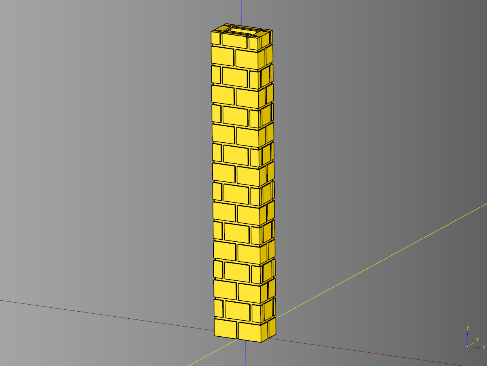
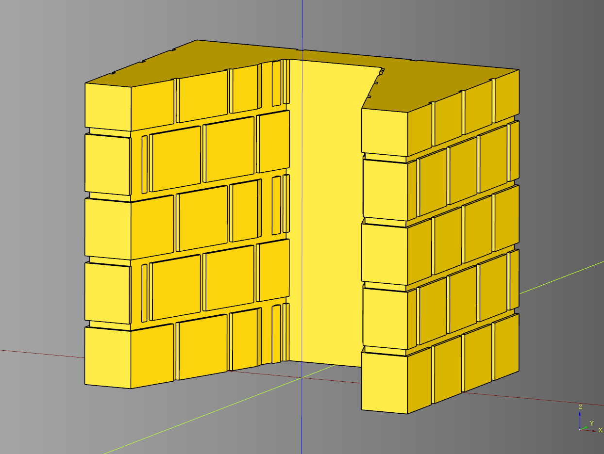
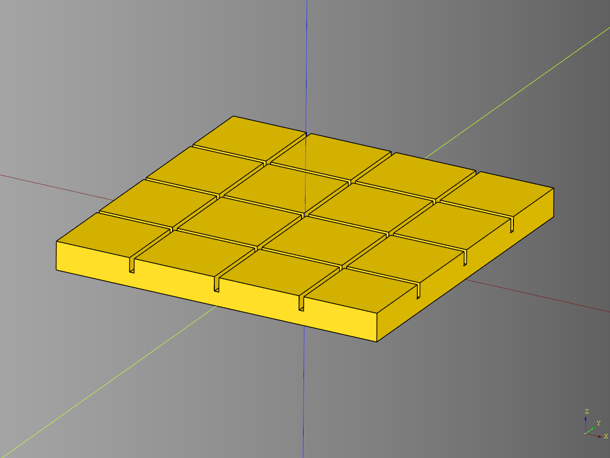
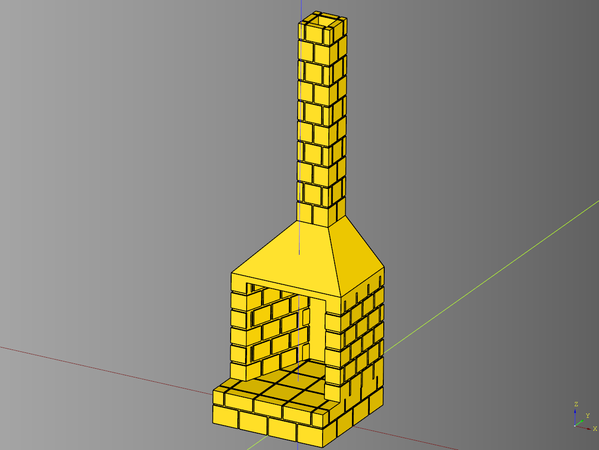

# Fireplace Documentation

---

## Chimney

### parameters
* length: float
* width: float
* height: float
* interior_padding: float

``` python
import cadquery as cq
from cqfantasy.fireplace import Chimney

bp_chimney = Chimney()
bp_chimney.length = 6
bp_chimney.width = 6
bp_chimney.height = 60
bp_chimney.interior_padding = 2

bp_chimney.make()
result = bp_chimney.build()

show_object(result)
```


* [source](../src/cqfantasy/fireplace/Chimney.py)
* [example](../example/fireplace/chimney.py)
* [stl](../stl/fireplace_chimney.stl)

---

## Chimney Tiled

### Parameters
* length: float
* width: float
* height: float
* interior_padding: float
* rows: int
* columns: int
* layers: int
* spacing: float
* tile_padding: float

``` python
import cadquery as cq
from cqfantasy.fireplace import ChimneyTiled

bp_chimney = ChimneyTiled()
bp_chimney.length = 6
bp_chimney.width = 6
bp_chimney.height = 60
bp_chimney.interior_padding = 2
bp_chimney.length = 10
bp_chimney.width = 6
bp_chimney.height = 60
bp_chimney.interior_padding = 2

bp_chimney.rows = 2
bp_chimney.columns = 2
bp_chimney.layers = 16
bp_chimney.spacing = .5
bp_chimney.tile_padding = 1.5

bp_chimney.make()
result = bp_chimney.build()

show_object(result)
```



* [source](../src/cqfantasy/fireplace/ChimneyTiled.py)
* [example](../example/fireplace/chimney_tiled.py)
* [stl](../stl/fireplace_chimney_tiled.stl)

---

## Fire Box

### parameters
* length: float
* width: float
* height: float
* x_padding: float
* y_padding: float
* interior_width: float

``` python
import cadquery as cq
from cqfantasy.fireplace import FireBox

bp_firebox = FireBox()
bp_firebox.length = 35
bp_firebox.width = 25
bp_firebox.height = 30
bp_firebox.x_padding = 5
bp_firebox.y_padding = 5
bp_firebox.interior_width = 10

bp_firebox.make()
result = bp_firebox.build()

show_object(result)
```


* [source](../src/cqfantasy/fireplace/FireBox.py)
* [example](../example/fireplace/fire_box.py)
* [stl](../stl/fireplace_firebox.stl)

---

## Fire Box Tiled

### parameters
* length: float
* width: float
* height: float
* x_padding: float
* y_padding: float
* interior_width: float
* rows: int
* columns: int
* layers: int
* spacing: float
* spacing_z: float
* tile_padding: float

``` python
import cadquery as cq
from cqfantasy.fireplace import FireBoxTiled

bp_firebox = FireBoxTiled()
bp_firebox.length = 35
bp_firebox.width = 25
bp_firebox.height = 30
bp_firebox.x_padding = 5
bp_firebox.y_padding = 5
bp_firebox.interior_width = 10

bp_firebox.rows = 4
bp_firebox.columns = 3
bp_firebox.layers = 5
bp_firebox.spacing = .7
bp_firebox.tile_padding = 2

bp_firebox.make()
result = bp_firebox.build()

show_object(result)
```



* [source](../src/cqfantasy/fireplace/FireBoxTiled.py)
* [example](../example/fireplace/fire_box_tiled.py)
* [stl](../stl/fireplace_firebox_tiled.stl)

---

## Fire Top

### parameters
* length: float
* width: float
* height: float
* top_height: float
* top_length: float
* top_width: float
* interior_padding: float

``` python
import cadquery as cq
from cqfantasy.fireplace import FireTop

bp_firetop = FireTop()
bp_firetop.length = 30
bp_firetop.width = 25
bp_firetop.height = 15
bp_firetop.top_height = 2
bp_firetop.top_length = 10
bp_firetop.top_width = 10 
bp_firetop.interior_padding = 2

bp_firetop.make()
result = bp_firetop.build()

show_object(result)
```


* [source](../src/cqfantasy/fireplace/FireTop.py)
* [example](../example/fireplace/fire_top.py)
* [stl](../stl/fireplace_firetop.stl)

---

## Hearth

### parameters
* length: float
* width: float
* height: float

``` python
import cadquery as cq
from cqfantasy.fireplace import Hearth

bp_hearth = Hearth()
bp_hearth.length = 35
bp_hearth.width = 35
bp_hearth.height = 3

bp_hearth.make()
result = bp_hearth.build()

show_object(result)
```


* [source](../src/cqfantasy/fireplace/Hearth.py)
* [example](../example/fireplace/hearth.py)
* [stl](../stl/fireplace_hearth.stl)

---

## Hearth Tiled

### parameters
* length: float
* width: float
* height: float

``` python
import cadquery as cq
from cqfantasy.fireplace import HearthTiled

bp_hearth = HearthTiled()
bp_hearth.length = 35
bp_hearth.width = 35
bp_hearth.height = 3
bp_hearth.tile_height = 1.5
bp_hearth.rows = 4
bp_hearth.columns = 4
bp_hearth.spacing = .5
bp_hearth.tile_padding = 2
bp_hearth.make()

ex_hearth = bp_hearth.build()

show_object(ex_hearth)
```



* [source](../src/cqfantasy/fireplace/HearthTiled.py)
* [example](../example/fireplace/hearth_tiled.py)
* [stl](../stl/fireplace_hearth_tiled.stl)

---

## Fireplace

### parameters
* interior_padding: float
* render_hearth: bool

``` python
import cadquery as cq
from cqfantasy.fireplace import Fireplace

bp_fireplace = Fireplace()
bp_fireplace.interior_padding = 2
bp_fireplace.render_hearth = True

bp_fireplace.make()
result = bp_fireplace.build()

show_object(result)
```


* [source](../src/cqfantasy/fireplace/Fireplace.py)
* [example](../example/fireplace/fireplace.py)
* [stl](../stl/fireplace.stl)

---

## Fireplace Tiled

### parameters
* interior_padding: float
* render_hearth: bool

``` python
import cadquery as cq
from cqfantasy.fireplace import Fireplace

bp_fireplace = Fireplace()
bp_fireplace.interior_padding = 2
bp_fireplace.render_hearth = True

bp_fireplace.make()
result = bp_fireplace.build()

show_object(result)
```



* [source](../src/cqfantasy/fireplace/FireplaceTiled.py)
* [example](../example/fireplace/fireplace_tiled.py)
* [stl](../stl/fireplace.stl)

---