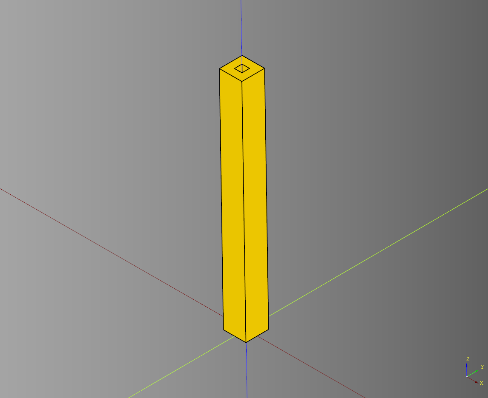
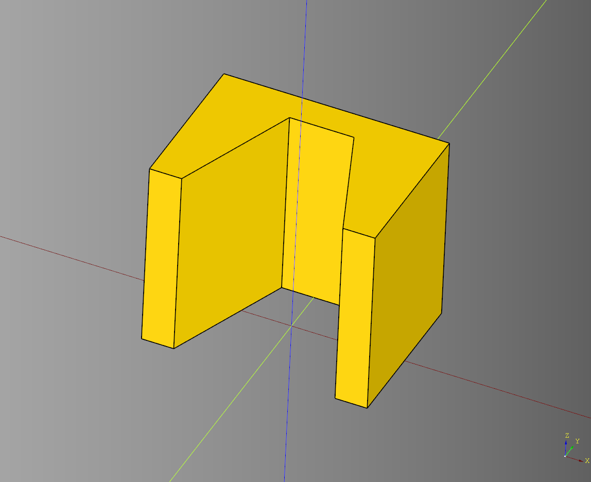
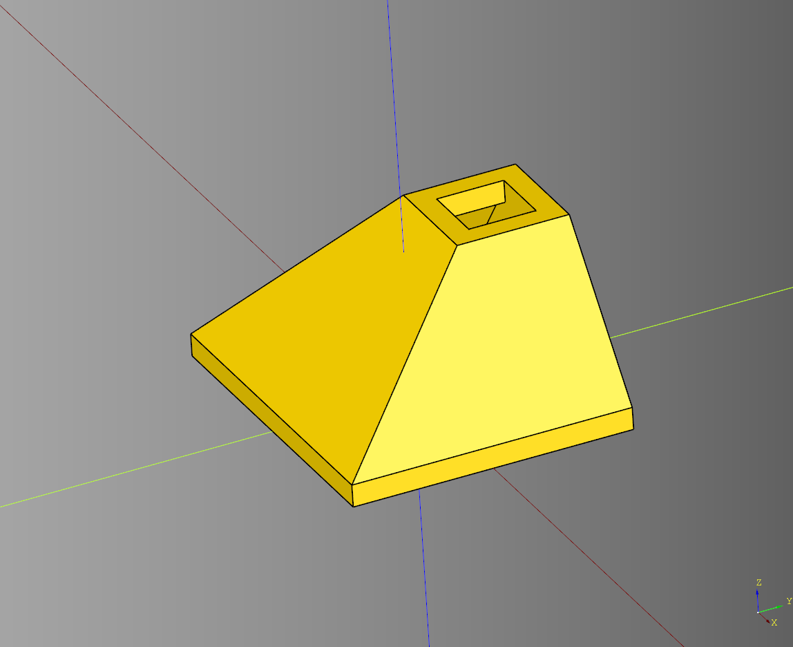
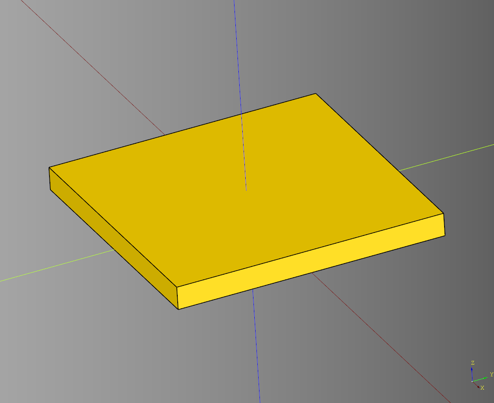
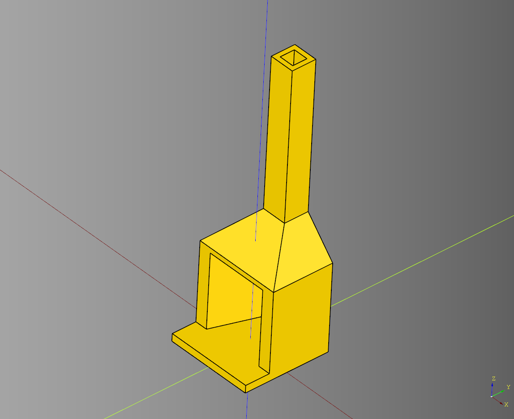

# Fireplace Documentation

---

## Chimney

### parameters
* length: float
* width: float
* height: float
* interior_padding: float

``` python
import cadquery as cq
from cqfantasy.fireplace import Chimney

bp_chimney = Chimney()
bp_chimney.length = 6
bp_chimney.width = 6
bp_chimney.height = 60
bp_chimney.interior_padding = 2

bp_chimney.make()
result = bp_chimney.build()

show_object(result)
```



 [source](../src/cqfantasy/door/.py)
* [example](../example/door/.py)
* [stl](../stl/.stl)

---

## Fire Box

### parameters
* length: float
* width: float
* height: float
* x_padding: float
* y_padding: float
* interior_width: float

``` python
import cadquery as cq
from cqfantasy.fireplace import FireBox

bp_firebox = FireBox()
bp_firebox.length = 35
bp_firebox.width = 25
bp_firebox.height = 30
bp_firebox.x_padding = 5
bp_firebox.y_padding = 5
bp_firebox.interior_width = 10

bp_firebox.make()
result = bp_firebox.build()

show_object(result)
```



 [source](../src/cqfantasy/door/.py)
* [example](../example/door/.py)
* [stl](../stl/.stl)

---

## Fire Top

### parameters
* length: float
* width: float
* height: float
* top_height: float
* top_length: float
* top_width: float
* interior_padding: float

``` python
import cadquery as cq
from cqfantasy.fireplace import FireTop

bp_firetop = FireTop()
bp_firetop.length = 30
bp_firetop.width = 25
bp_firetop.height = 15
bp_firetop.top_height = 2
bp_firetop.top_length = 10
bp_firetop.top_width = 10 
bp_firetop.interior_padding = 2

bp_firetop.make()
result = bp_firetop.build()

show_object(result)
```



 [source](../src/cqfantasy/door/.py)
* [example](../example/door/.py)
* [stl](../stl/.stl)

---


## Hearth

### parameters
* length: float
* width: float
* height: float

``` python
import cadquery as cq
from cqfantasy.fireplace import Hearth

bp_hearth = Hearth()
bp_hearth.length = 35
bp_hearth.width = 35
bp_hearth.height = 3

bp_hearth.make()
result = bp_hearth.build()

show_object(result)
```



 [source](../src/cqfantasy/door/.py)
* [example](../example/door/.py)
* [stl](../stl/.stl)

---


## Fireplace

### parameters
* interior_padding: float
* render_hearth: bool

``` python
import cadquery as cq
from cqfantasy.fireplace import Fireplace

bp_fireplace = Fireplace()
bp_fireplace.interior_padding = 2
bp_fireplace.render_hearth = True

bp_fireplace.make()
result = bp_fireplace.build()

show_object(result)
```



 [source](../src/cqfantasy/door/.py)
* [example](../example/door/.py)
* [stl](../stl/.stl)

---