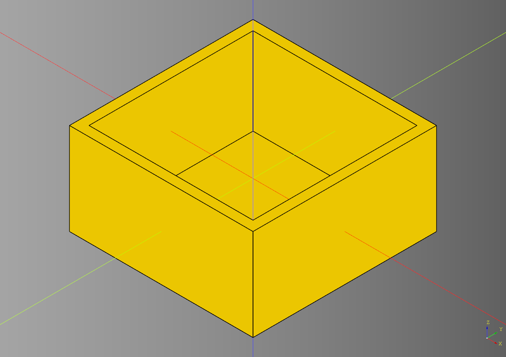
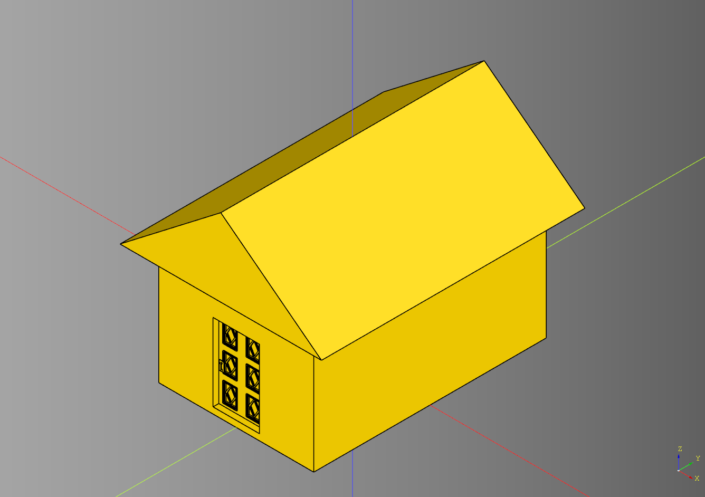
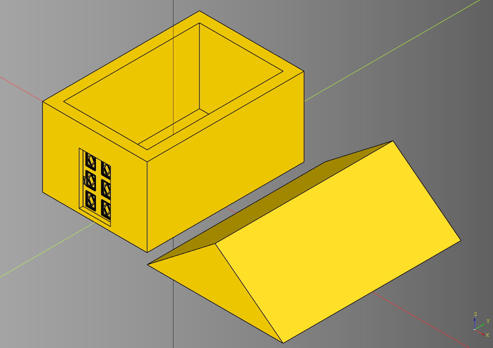
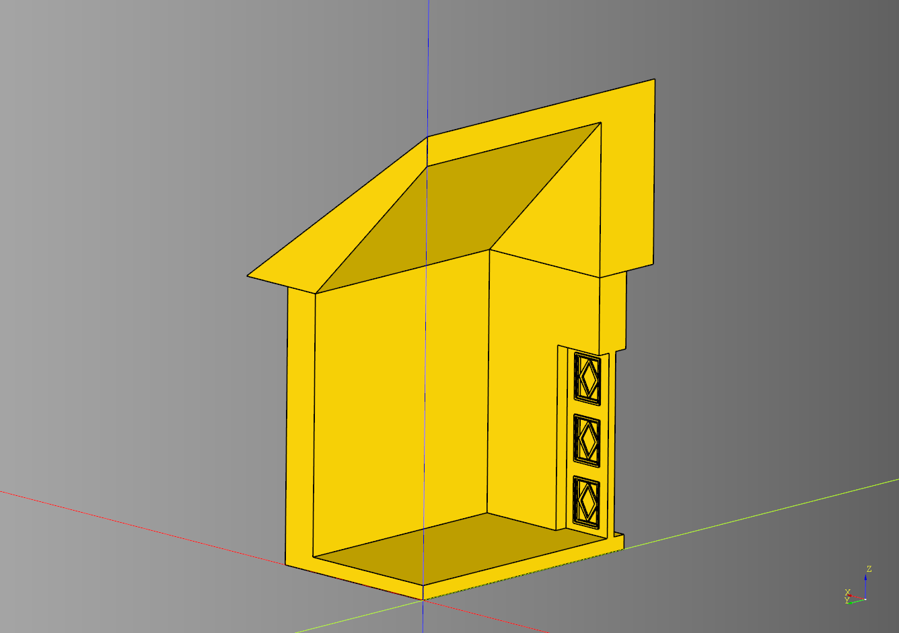
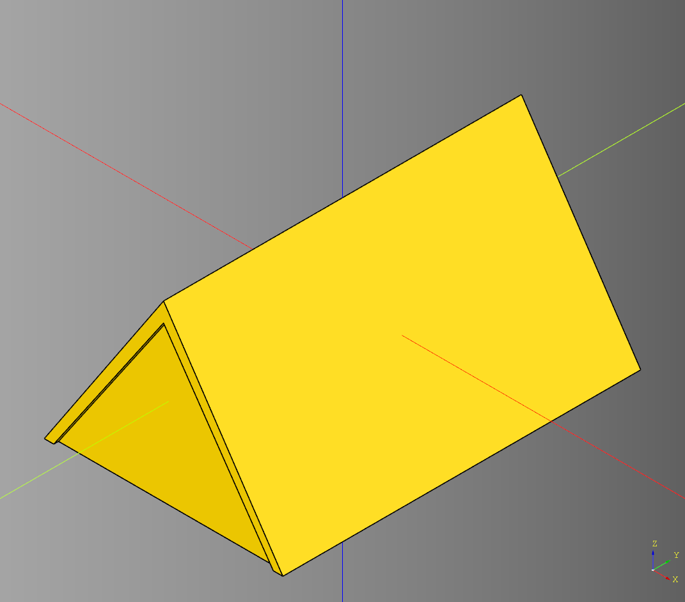
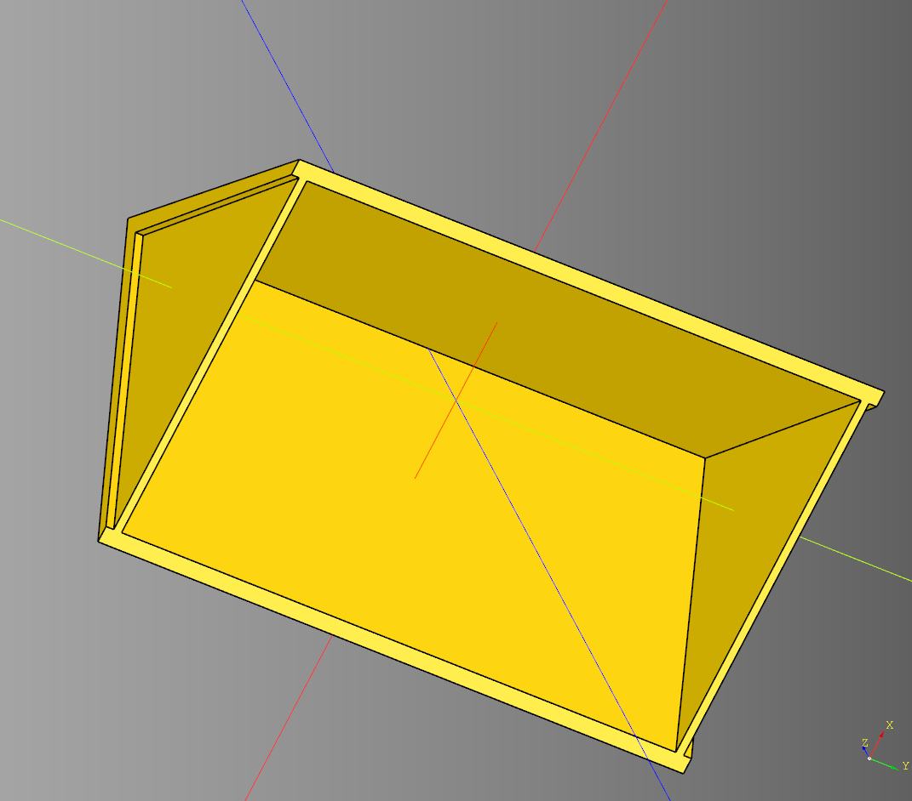

# House

## Body
### parameters
* length: float
* width: float
* height: float
* wall_width: float
* floor_height: float

``` python
import cadquery as cq
from cqfantasy.house import Body

bp_body = Body()
bp_body.length = 150
bp_body.width = 150
bp_body.height = 75
bp_body.wall_width = 8
bp_body.floor_height = 4

bp_body.make()
ex_body = bp_body.build()

show_object(ex_body)
```



* [source](../src/cqfantasy/house/Body.py)
* [example](../example/house/body.py)
* [stl](../stl/house_body.stl)

---

## House
Orchestrator class for combining components of a house.
### parameters
* length: float
* width: float
* height: float
* roof_height: float
* roof_overhang: Tuple[float,float]
* roof_gap_spacer: float
* door_cut_width_padding: floatdoor_cut_width_padding

### blueprints
* bp_body = Body()
* bp_roof = Roof()
* bp_door = TiledDoor()

``` python
import cadquery as cq
from cqfantasy.house import House

bp_house = House()
bp_house.length = 100
bp_house.width = 150
bp_house.height = 75
bp_house.roof_height = 50
bp_house.roof_overhang = (15,10)

bp_body = bp_house.bp_body
bp_body.wall_width = 10

bp_door = bp_house.bp_door
bp_door.height = 50
bp_door.width = 2.5

bp_roof = bp_house.bp_roof

bp_house.make()
ex_house = bp_house.build()

show_object(ex_house)
```



* [source](../src/cqfantasy/house/House.py)
* [example](../example/house/house.py)
* [stl](../stl/house.stl)

### Plate Example
``` python
import cadquery as cq
from cqfantasy.house import House

bp_house = House()
bp_house.length = 100
bp_house.width = 150
bp_house.height = 75
bp_house.roof_height = 50
bp_house.roof_overhang = (15,10)

bp_body = bp_house.bp_body
bp_body.wall_width = 10

bp_door = bp_house.bp_door
bp_door.height = 50
bp_door.width = 2.5

bp_roof = bp_house.bp_roof

bp_house.make()
ex_house_plate = bp_house.build_plate()

show_object(ex_house_plate)
```



* [example](../example/house/house_plate.py)
* [stl](../stl/house_plate.stl)

### Cut Away Example

``` python
import cadquery as cq
from cqfantasy.house import House

bp_house = House()
bp_house.length = 100
bp_house.width = 150
bp_house.height = 75
bp_house.roof_height = 50
bp_house.roof_overhang = (15,10)

bp_body = bp_house.bp_body
bp_body.wall_width = 10

bp_door = bp_house.bp_door
bp_door.height = 50
bp_door.width = 2.5

bp_roof = bp_house.bp_roof

bp_house.make()
ex_house_cut_away = bp_house.build_cut_away()
```



* [example](../example/house/house_cut_away.py)
* [stl](../stl/house_cut_away.stl)

---

## Roof
### parameters
* length: float
* width: float
* height: float
* overhang: Tuple[float,float,float]

``` python
import cadquery as cq
from cqfantasy.house import Roof

bp_roof = Roof()
bp_roof.length = 100
bp_roof.width = 150
bp_roof.height = 75

bp_roof.overhang = (4,4,4)
bp_roof.make()
ex_roof = bp_roof.build()

show_object(ex_roof)
```




* [source](../src/cqfantasy/house/Roof.py)
* [example](../example/house/roof.py)
* [stl](../stl/house_roof.stl)

---