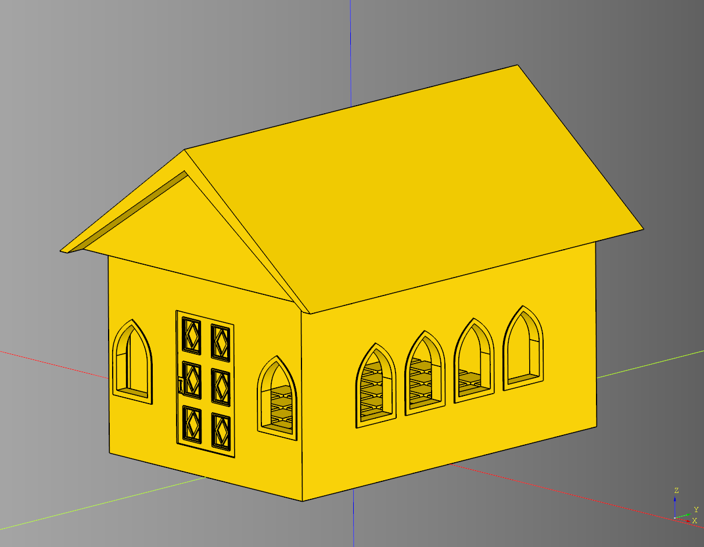
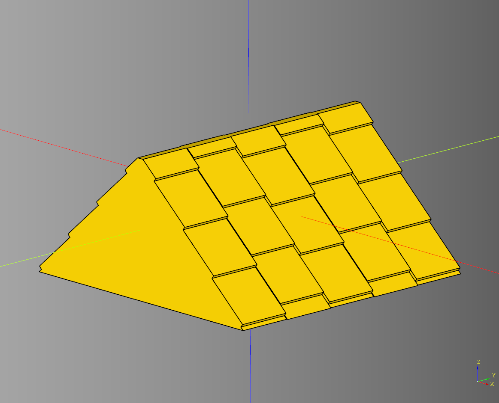
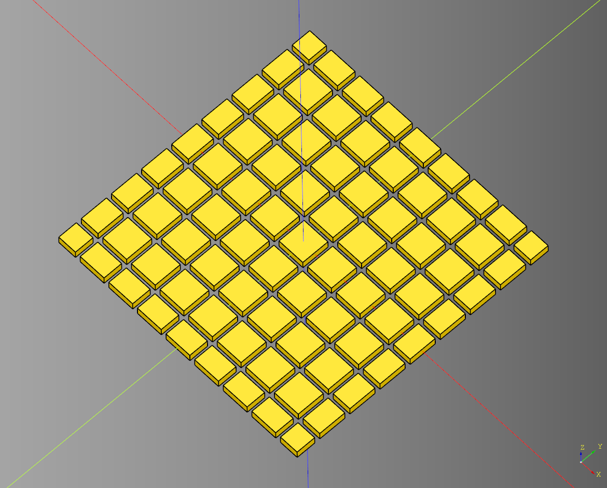
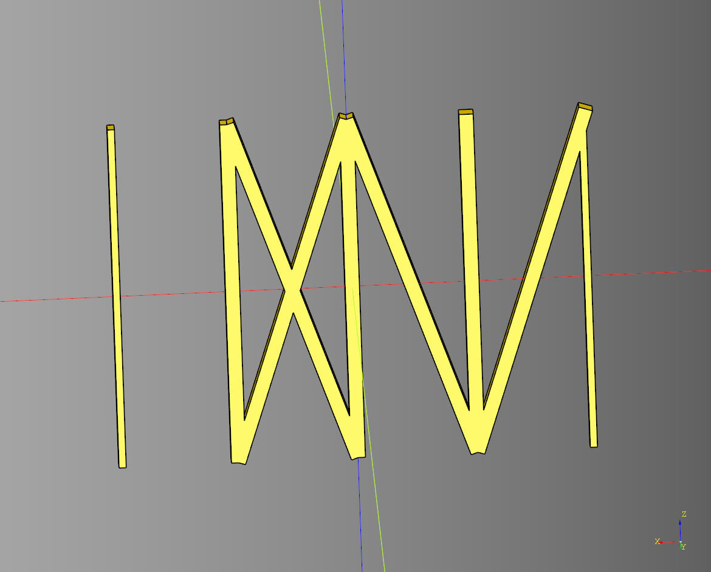

# House

## Body
### parameters
* length: float
* width: float
* height: float
* wall_width: float
* floor_height: float

``` python
import cadquery as cq
from cqfantasy.house import Body

bp_body = Body()
bp_body.length = 150
bp_body.width = 150
bp_body.height = 75
bp_body.wall_width = 8
bp_body.floor_height = 4

bp_body.make()
ex_body = bp_body.build()

show_object(ex_body)
```


* [source](../src/cqfantasy/house/Body.py)
* [example](../example/house/body.py)
* [stl](../stl/house_body.stl)

---

## House
Orchestrator class for combining components of a house.
### parameters
* length: float
* width: float
* height: float
* roof_height: float
* roof_overhang: Tuple[float,float]
* roof_gap_spacer: float
* door_cut_width_padding: floatdoor_cut_width_padding

### blueprints
* bp_body = Body()
* bp_roof = Roof()
* bp_door = TiledDoor()

``` python
import cadquery as cq
from cqfantasy.house import House

bp_house = House()
bp_house.length = 100
bp_house.width = 150
bp_house.height = 75
bp_house.roof_height = 50
bp_house.roof_overhang = (15,10)

bp_body = bp_house.bp_body
bp_body.wall_width = 10

bp_door = bp_house.bp_door
bp_door.height = 50
bp_door.width = 2.5

bp_roof = bp_house.bp_roof

bp_house.make()
ex_house = bp_house.build()

show_object(ex_house)
```



* [source](../src/cqfantasy/house/House.py)
* [example](../example/house/house.py)
* [stl](../stl/house.stl)

### Plate Example
``` python
import cadquery as cq
from cqfantasy.house import House

bp_house = House()
bp_house.length = 100
bp_house.width = 150
bp_house.height = 75
bp_house.roof_height = 50
bp_house.roof_overhang = (15,10)

bp_body = bp_house.bp_body
bp_body.wall_width = 10

bp_door = bp_house.bp_door
bp_door.height = 50
bp_door.width = 2.5

bp_roof = bp_house.bp_roof

bp_house.make()
ex_house_plate = bp_house.build_plate()

show_object(ex_house_plate)
```


* [example](../example/house/house_plate.py)
* [stl](../stl/house_plate.stl)

### Cut Away Example

``` python
import cadquery as cq
from cqfantasy.house import House

bp_house = House()
bp_house.length = 100
bp_house.width = 150
bp_house.height = 75
bp_house.roof_height = 50
bp_house.roof_overhang = (15,10)

bp_body = bp_house.bp_body
bp_body.wall_width = 10

bp_door = bp_house.bp_door
bp_door.height = 50
bp_door.width = 2.5

bp_roof = bp_house.bp_roof

bp_house.make()
ex_house_cut_away = bp_house.build_cut_away()
```


* [example](../example/house/house_cut_away.py)
* [stl](../stl/house_cut_away.stl)

---

## Roof
### parameters
* length: float
* width: float
* height: float
* overhang: Tuple[float,float,float]
* render_overhang_inset:bool
* overhang_inset:Tuple[float,float,float]

``` python
import cadquery as cq
from cqfantasy.house import Roof

bp_roof = Roof()
bp_roof.length = 100
bp_roof.width = 150
bp_roof.height = 75

bp_roof.overhang = (4,4,4)

bp_roof.render_overhang_inset = True
bp_roof.overhang_inset = (4,2,4)

bp_roof.make()
ex_roof = bp_roof.build()

show_object(ex_roof)
```


* [source](../src/cqfantasy/house/Roof.py)
* [example](../example/house/roof.py)
* [stl](../stl/house_roof.stl)

---
## ShingleRoof

### parameters
* render_shingles:bool = True
* tile_length:float = 10
* tile_width:float = 10
* tile_height:float = 0.8
* tile_rotation:float = 4
* tile_push:float = 2

``` python
import cadquery as cq
from cqfantasy.house import ShingleRoof

bp_roof = ShingleRoof()
bp_roof.height = 25
bp_roof.length = 50
bp_roof.width = 50
bp_roof.make()
ex_roof = bp_roof.build()

show_object(ex_roof.translate((0,0,0)))
```



* [source](../src/cqfantasy/house/ShingleRoof.py)
* [example](../example/house/shingle_roof.py)
* [stl](../stl/house_roof_shingle.stl)
---

## StuccoBrickBody

### params
* render_stones: bool
* seed: str
* cell_types: list[str]
* y_count: int
* x_count: int
* block_length: float
* block_width: float
* block_height: float
* block_spacing: float

``` python
import cadquery as cq
from cqfantasy.house import StuccoBrickBody

bp_body_stucco = StuccoBrickBody()

bp_body_stucco.seed = 'test2'
bp_body_stucco.length = 100
bp_body_stucco.render_stones= True
bp_body_stucco.cell_types = [
    'block',
    'block', 
    'empty',
    'block'
]

bp_body_stucco.block_length = 8
bp_body_stucco.block_width = 5
bp_body_stucco.block_height = 3
bp_body_stucco.block_spacing = 2
bp_body_stucco.make()

ex_body_stucco = bp_body_stucco.build()

show_object(ex_body_stucco)
```


* [source](../src/cqfantasy/house/StuccoBrickBody.py)
* [example](../example/house/stucco_brick_body.py)
* [stl](../stl/house_body_stucco_brick.stl)

---

## TileGenerator

### params
* length: float
* width: float
* tile_length: float
* tile_width: float
* tile_height: float
* tile_padding: float
* overflow: float
* make_tile_method: Callable[[float, float, float], cq.Workplane]
* render_intersect: bool

``` python
import cadquery as cq
from cqfantasy.house import TileGenerator

def make_basic_tile(
    length:float, 
    width:float, 
    height:float
) -> cq.Workplane:
    tile = cq.Workplane("XY").box(
        length, 
        width, 
        height
    )
    return tile

bp_tile = TileGenerator()

bp_tile.length= 100
bp_tile.width = 100
bp_tile.tile_length = 10
bp_tile.tile_width = 10
bp_tile.tile_height = 3
bp_tile.tile_padding = 1
bp_tile.overflow = 12
bp_tile.make_tile_method = make_basic_tile

bp_tile.make()

ex_tiles = bp_tile.build()

show_object(ex_tiles)
```



* [source](../src/cqfantasy/house/TileGenerator.py)
* [example](../example/house/tile_generator.py)
* [stl](../stl/house_tile_generator.stl)

---

## TudorBody

### params
* split_width: float
* split_height: float
* corner_length: float
* corner_width: float
* split_divide_height: float
* panel_length: float
* panel_width: float 
* panel_space: float
* x_styles: list[str|None]|str|None
* y_styles: list[str|None]|str|None

``` python
import cadquery as cq
from cqfantasy.house import TudorBody

bp_body = TudorBody()
bp_body.length = 150
bp_body.width = 100

bp_body.x_styles = [None,"right","left","right","left"]
bp_body.y_styles = ["cross","left","right","cross"]

bp_body.split_divide_height = 25
bp_body.panel_length = 25
bp_body.panel_width = 2.5
bp_body.panel_space = 2

bp_body.make()
ex_body = bp_body.build()

show_object(ex_body)
```


* [source](../src/cqfantasy/house/TudorBody.py)
* [example](../example/house/tudor_body.py)
* [stl](../stl/house_body_tudor.stl)

---

## TudorSplitBody
Combination of TudorBody and StuccoBrickBody

### params
self.split_width: float
self.split_height: float
self.corner_length: float
self.corner_width: float
self.split_divide_height: float
self.render_stones: bool
self.seed: str
self.cell_types: list[str]
self.y_count: int
self.x_count: int
self.block_length: float
self.block_width: float
self.block_height: float
self.block_spacing: float
self.panel_length: float
self.panel_width: float
self.panel_space: float
self.x_styles: list[str|None]|str|None
self.y_styles: list[str|None]|str|None

``` python
import cadquery as cq
from cqfantasy.house import TudorBody

bp_body = TudorBody()
bp_body.length = 150
bp_body.width = 100

bp_body.x_styles = [None,"right","left","right","left"]
bp_body.y_styles = ["cross","left","right","cross"]

bp_body.split_divide_height = 25
bp_body.panel_length = 25
bp_body.panel_width = 2.5
bp_body.panel_space = 2

bp_body.make()
ex_body = bp_body.build()

show_object(ex_body)
```


* [source](../src/cqfantasy/house/TudorSplitBody.py)
* [example](../example/house/tudor_split_body.py)
* [stl](../stl/house_body_tudor_split.stl)

---

## TudorWall

### params
* length: float 
* height: float
* styles: list[str|None]|str|None
* panel_length: float
* panel_space: float 
* panel_width: float

``` python
import cadquery as cq
from cqfantasy.house import tudor_wall

ex_wall = tudor_wall(
    length = 100, 
    height = 75, 
    styles = [None,"cross","left","right"], 
    panel_length = 25, 
    panel_space = 3, 
    panel_width = 3
)
show_object(ex_wall)
```



* [source](../src/cqfantasy/house/TudorWall.py)
* [example](../example/house/tudor_wall.py)
* [stl](../stl/house_wall_tudor.stl)
  
---
