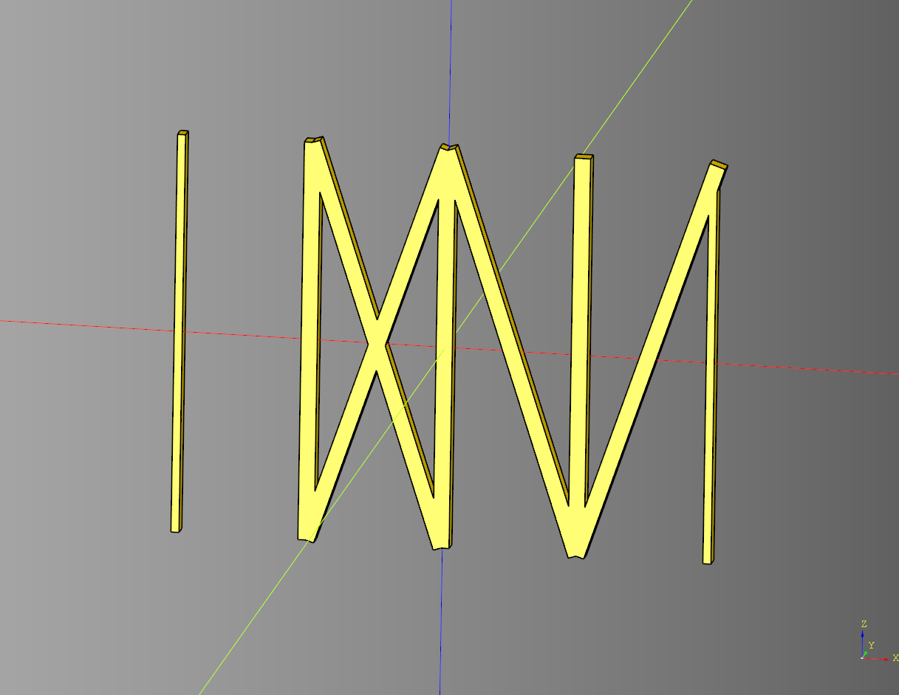
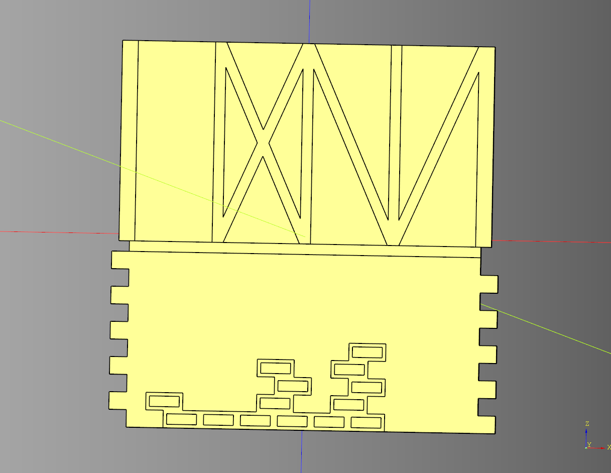
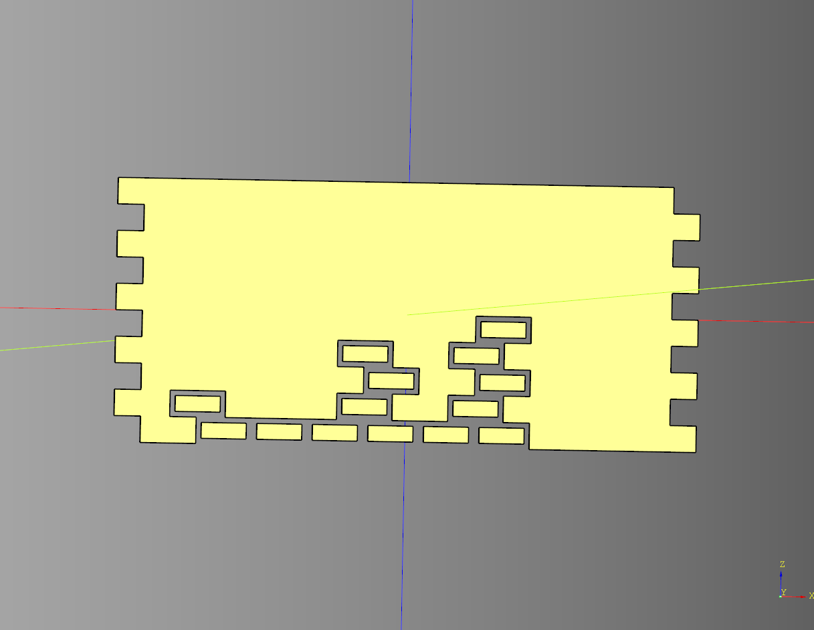
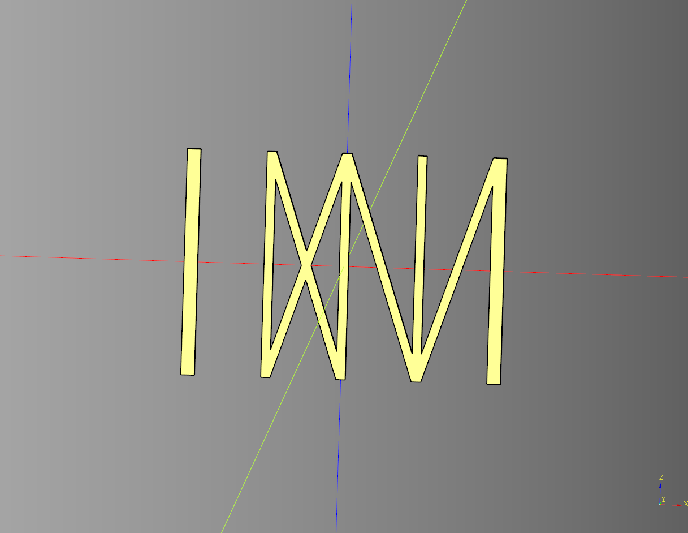
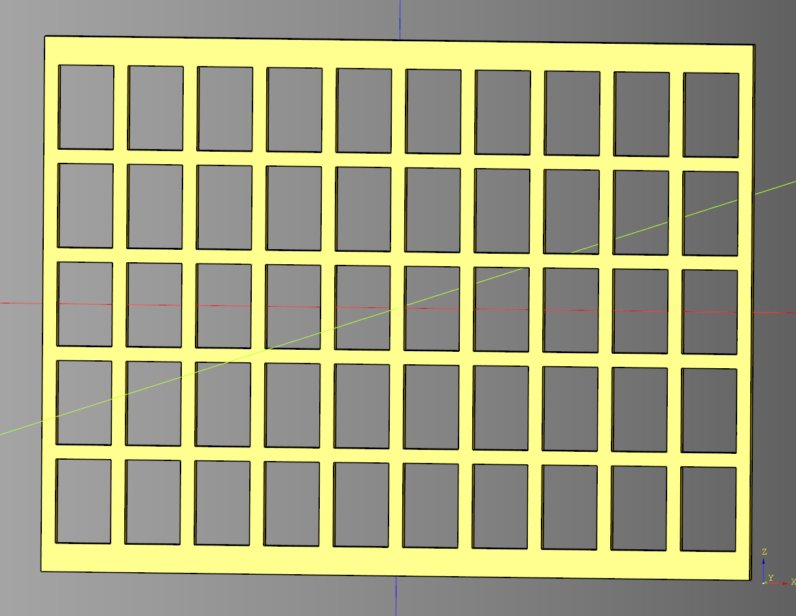

# House Wall Documentation

## Tudor Wall
Helper method that creates tudor wall greebles base on passed in configuration.

### parameters
* length:float
* height:float
* styles:list[str|None]|str|None = [None,"cross","left","right"] - Can pass this nothing, a string, or a list of strings.
* panel_length:float
* panel_space:float
* panel_width:float

``` python
import cadquery as cq
from cqfantasy.house_wall import tudor_wall

ex_wall = tudor_wall(
    length = 100, 
    height = 75, 
    styles = [None,"cross","left","right"], 
    panel_length = 25, 
    panel_space = 3, 
    panel_width = 3
)
show_object(ex_wall)
```



* [source](../src/cqfantasy/house_wall/tudor_wall.py)
* [example](../example/house_wall/tudor_wall.py)
* [stl](../stl/house_wall_tudor.stl)

## Wall Split
Orchestrator class for joining two wall segments together.

### parameters
* length: float
* width: float
* height: float
* split_height: float
* split_divide_height: float

### blueprints
* bp_upper_wall = None
* bp_lower_wall = None

``` python
import cadquery as cq
from cqfantasy.house_wall import WallSplit, WallTudor, WallStuccoBrick

bp_wall = WallSplit()
bp_wall.height=110
bp_wall.bp_upper_wall = WallTudor()
bp_wall.bp_lower_wall = WallStuccoBrick()
bp_wall.split_divide_height = 51.5
bp_wall.make()
ex_wall = bp_wall.build()
outline = bp_wall.build_cut()

show_object(ex_wall)
show_object(outline.translate((0,.5,0))) 
```



* [source](../src/cqfantasy/house_wall/WallSplit.py)
* [example](../example/house_wall/wall_split_class.py)
* [stl](../stl/house_wall_split_class.stl)

## Wall Stucco Brick
Representative a wall with patches of exposed stucco brick. Uses a very simple wave form collapse algorithm to create the brick pattern.

### parameters
* length: float
* width: float
* height: float
* seed: str
* cell_types: list[str] 
* center: bool
* spread_width: bool
* block_length: float
* block_height: float
* block_spacing: float
* outline_intersect: bool

``` python
import cadquery as cq
from cqfantasy.house_wall import WallStuccoBrick

bp_wall = WallStuccoBrick()

bp_wall.length = 100
bp_wall.height = 50
bp_wall.seed = 'test'
bp_wall.cell_types = [
    'block',
    'block', 
    'empty',
    'block'
]

bp_wall.block_length = 8
bp_wall.width = 5
bp_wall.block_height = 3
bp_wall.block_spacing = 2

bp_wall.make()
ex_wall = bp_wall.build()

show_object(ex_wall)
```



* [source](../src/cqfantasy/house_wall/WallStuccoBrick.py)
* [example](../example/house_wall/wall_stucco_brick_class.py)
* [stl](../stl/house_wall_stucco_brick_class.stl)

## Wall Tudor
Wrapper around the wall tudor helper method.

### parameters
* length:float
* width:float
* height:float
* styles:list[str|None]|str|None = [None,"cross","left","right"]
* panel_length:float
* panel_space:float
* panel_sections:int|None
* outline_intersect:bool
* render_top_bar:bool
* render_bottom_bar:bool
* render_side_bar:bool
* bar_length:float
* bar_height:float

``` python
import cadquery as cq
from cqfantasy.house_wall import WallTudor

bp_wall = WallTudor()

bp_wall.length = 100
bp_wall.width = 3
bp_wall.height = 75 
bp_wall.styles = [None,"cross","left","right"]
bp_wall.panel_length = 25
bp_wall.panel_space = 3

bp_wall.render_top_bar = False
bp_wall.render_bottom_bar = False
bp_wall.bar_height = 3


bp_wall.make()

ex_wall = bp_wall.build()

show_object(ex_wall)
```



* [source](../src/cqfantasy/house_wall/WallTudor.py)
* [example](../example/house_wall/wall_tudor_class.py)
* [stl](../stl/house_wall_tudor_class.stl)

## Wall Tudor Paneling
Representative of internal tudor wall style paneling.

### parameters
* length: float
* width: float
* height: float
* render_outline: bool
* h_frame_height: float
* v_frame_length: float
* rows: int
* columns: int
* row_height: float
* column_width: float

``` python
import cadquery as cq
from cqfantasy.house_wall import WallTudorPaneling

bp_wall = WallTudorPaneling()

bp_wall.length = 100
bp_wall.width = 2
bp_wall.height = 75

bp_wall.render_outline = False
bp_wall.h_frame_height = 4
bp_wall.v_frame_length = 2
bp_wall.rows = 5
bp_wall.columns = 10
bp_wall.row_height = 2
bp_wall.column_width = 2

bp_wall.make()

ex_wall = bp_wall.build()

show_object(ex_wall)
```



* [source](../src/cqfantasy/house_wall/WallTudorPaneling.py)
* [example](../example/house_wall/wall_tudor_paneling_class.py)
* [stl](../stl/house_wall_tudor_paneling_class.stl)

