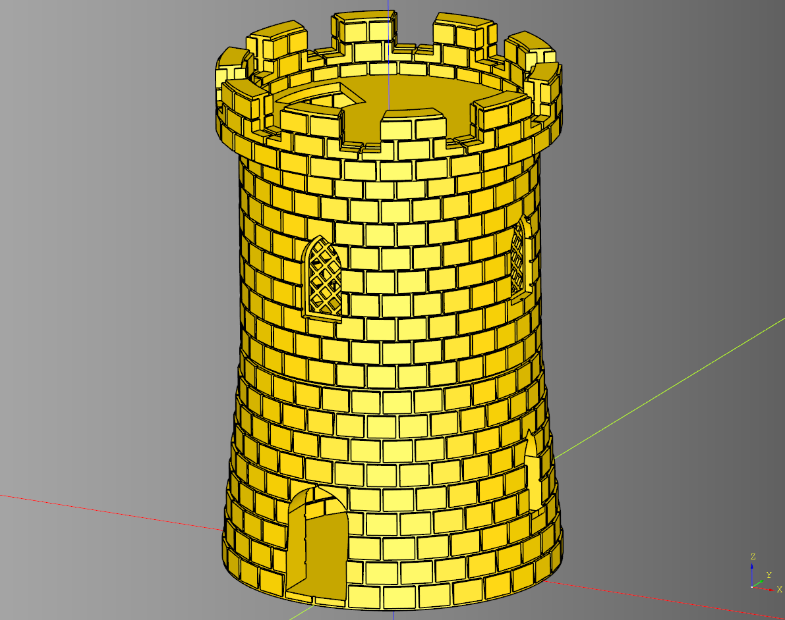

# Tower

## cut_cylinder
Helper class creates a cylinder to be cut out of the parent shape

### parameters
* parent: cq.Workplane 
* diameter: float 
* height: float

``` python
import cadquery as cq
from cqfantasy.tower import cut_cylinder

test_shape = cq.Workplane("XY").box(50,50,50)

test_shape = cut_cylinder(test_shape,40, 40)

show_object(test_shape)
```


* [source](../src/cqfantasy/tower/cut_cylinder.py)
* [example](../example/tower/cut_cylinder.py)
* [stl](../stl/tower_cut_cylinder.stl)

---

## FrameWindow
Inherits from tower window.

### parameters
* frame_width:float
* frame_margin:float
* length: float
* width: float
* height: float
* inner_height_margin: float
* diameter: float
* render_outline: bool
        
### parts
* frame_outline: cq.Workplane|None
* frame: cq.Workplane|None

``` python
import cadquery as cq
from cqfantasy.tower import FrameWindow

bp_window = FrameWindow()
bp_window.length = 25
bp_window.width = 2
bp_window.height = 30
bp_window.inner_height_margin = 15

bp_window.diameter = 130
bp_window.render_outline = False

bp_window.frame_width = 2
bp_window.frame_margin = 2
bp_window.make()

window = bp_window.build()

show_object(window)
```


* [source](../src/cqfantasy/tower/FrameWindow.py)
* [example](../example/tower/frame_window.py)
* [stl](../stl/tower_frame_window.stl)

---

## LatticeWindow
Inherits from tower window.

### parameters
* frame_width: float
* frame_margin: float
* lattice_angle: float
* lattice_height: float
* tile_size: float
* length: float
* width: float
* height: float
* inner_height_margin: float
* diameter: float
* render_outline: bool
        
# parts
frame_outline:cq.Workplane|None = None
frame:cq.Workplane|None = None
lattice:cq.Workplane|None = None

``` python
import cadquery as cq
from cqfantasy.tower import LatticeWindow

bp_window = LatticeWindow()
bp_window.frame_width = 2
bp_window.frame_margin = 2
bp_window.lattice_angle = 45
bp_window.lattice_width = 1.5
bp_window.lattice_height = 1.3
bp_window.tile_size = 4.5

bp_window.length = 25
bp_window.width = 2
bp_window.height = 30
bp_window.inner_height_margin = 15

bp_window.diameter = 130
bp_window.render_outline = False
bp_window.make()

window = bp_window.build()

show_object(window)
```


* [source](../src/cqfantasy/tower/LatticeWindow.py)
* [example](../example/tower/lattice_window.py)
* [stl](../stl/tower_lattice_window.stl)

---

## Tile Generator
Generates tiles for tower floors

### parameters
* diameter: float
* *tile_length: float
* tile_width: float
* tile_height: float
* tile_padding: float
* overflow: float
* make_tile_method: Callable[[float, float, float], cq.Workplane]

### Plain Example
``` python
import cadquery as cq
from cqfantasy.tower import TileGenerator

def make_basic_tile(
    length:float, 
    width:float, 
    height:float
) -> cq.Workplane:
    tile = cq.Workplane("XY").box(
        length, 
        width, 
        height
    )
    return tile

bp_tiles = TileGenerator()

bp_tiles.diameter = 100
bp_tiles.tile_length = 10
bp_tiles.tile_width = 10
bp_tiles.tile_height = 3
bp_tiles.tile_padding = 1
bp_tiles.overflow = 12
bp_tiles.make_tile_method = make_basic_tile

bp_tiles.make()

tiles = bp_tiles.build()

show_object(tiles)
```


* [source](../src/cqfantasy/tower/TileGenerator.py)
* [example](../example/tower/tile_generator.py)
* [stl](../stl/tower_tile_generator.stl)

### Detailed Examples
``` python
import cadquery as cq
from cqfantasy.tower import TileGenerator
from cqterrain.tile import dwarf_star

def make_dwarf_star(
    length:float, 
    width:float, 
    height:float
) -> cq.Workplane:
    tile = dwarf_star(
        length, 
        width, 
        height
        #set hardcoded overrides here
    )
    return tile

bp_tiles = TileGenerator()

bp_tiles.diameter = 50
bp_tiles.tile_length = 15
bp_tiles.tile_width = 15
bp_tiles.tile_height = 2
bp_tiles.tile_padding = .5
bp_tiles.overflow = 12
bp_tiles.make_tile_method = make_dwarf_star

bp_tiles.make()

tiles = bp_tiles.build()

show_object(tiles)
```


* [source](../src/cqfantasy/tower/TileGenerator.py)
* [example](../example/tower/tile_generator_dwarf_star.py)
* [stl](../stl/tower_tile_generator_dwarf_star.stl)


---

## Tower
Orchestrator class

### blueprints
* base_bp: TowerBase
* mid_bp: TowerMid
* top_bp: TowerTop

``` python
import cadquery as cq
from cqfantasy.tower import Tower, LatticeWindow

bp_tower = Tower()
bp_tower.base_bp.render_blocks = True
bp_tower.mid_bp.render_blocks = True
bp_tower.mid_bp.bp_window = LatticeWindow()
bp_tower.top_bp.render_blocks = True
bp_tower.make()
ex = bp_tower.build()
show_object(ex)
```



* [source](../src/cqfantasy/tower/Tower.py)
* [example](../example/tower/tower_example.py)
* [stl](../stl/tower_example.stl)

---

## TowerBase

### parameters
* diameter: float
* base_diameter: float
* height: float
* wall_width: float
* floor_height: float
* block_length: float
* block_width: float
* block_height: float
* block_ring_count: int
* even_ring_rotate: float
* render_blocks: bool
* render_stairs: bool
* render_window_outline: bool
* window_length: float
* window_width: float
* window_height: float
* window_padding: float
* window_count: int
* door_length: float
* door_width: float
* door_height: float
* door_padding: float
* door_count: int
* render_magnets: bool
* magnet_diameter: float
* magnet_height: float
* magnet_count: int
* render_floor_tile: bool = True
* tile_height: bool = 2

### blueprints
* bp_window: TowerWindow
* bp_door: TowerDoor
* bp_tile_gen: TileGenerator|None 

``` python
import cadquery as cq
from cqfantasy.tower import TowerBase

bp_tower_base = TowerBase()
# properties
bp_tower_base.diameter = 130
bp_tower_base.base_diameter = 150
bp_tower_base.height = 100

bp_tower_base.wall_width = 4
bp_tower_base.floor_height = 4

bp_tower_base.block_length = 5
bp_tower_base.block_width = 14
bp_tower_base.block_height = 10

bp_tower_base.block_ring_count = 30
bp_tower_base.even_ring_rotate = 6

bp_tower_base.render_blocks = True
bp_tower_base.render_stairs = True
bp_tower_base.render_window_outline = False

bp_tower_base.window_length = 12
bp_tower_base.window_width = 18
bp_tower_base.window_height = 40
bp_tower_base.window_padding = 6
bp_tower_base.window_count = 2

bp_tower_base.door_length = 30
bp_tower_base.door_width = 27
bp_tower_base.door_height = 50
bp_tower_base.door_padding = 7
bp_tower_base.door_count = 1

bp_tower_base.render_magnets = True
bp_tower_base.magnet_diameter = 3.4
bp_tower_base.magnet_height = 2.2
bp_tower_base.magnet_count = 4

bp_tower_base.render_floor_tile = True
bp_tower_base.tile_height = 2

bp_tower_base.make()
ex_tower = bp_tower_base.build()
show_object(ex_tower)
```


* [source](../src/cqfantasy/tower/TowerBase.py)
* [example](../example/tower/tower_base.py)
* [stl](../stl/tower_base.stl)

---

## TowerBaseGreebled
Inherits from [TowerBase](#towerbase)

### parameters
* uneven_block_depth: float
* render_base: bool
* render_outside_blocks: bool
* render_inside_blocks: bool

``` python
import cadquery as cq
from cqfantasy.tower import TowerBaseGreebled

bp_tower_base = TowerBaseGreebled()
bp_tower_base.uneven_block_depth = 1
bp_tower_base.seed = 'test4'
bp_tower_base.render_base = True
bp_tower_base.render_blocks = True
bp_tower_base.render_outside_blocks = True
bp_tower_base.render_inside_blocks = True

bp_tower_base.diameter = 130
bp_tower_base.base_diameter = 150
bp_tower_base.height = 100

bp_tower_base.wall_width = 4
bp_tower_base.floor_height = 4

bp_tower_base.block_length = 5
bp_tower_base.block_width = 14
bp_tower_base.block_height = 10

bp_tower_base.block_ring_count = 30
bp_tower_base.even_ring_rotate = 6

bp_tower_base.render_stairs = True
bp_tower_base.render_window_outline = False

bp_tower_base.window_length = 12
bp_tower_base.window_width = 18
bp_tower_base.window_height = 40
bp_tower_base.window_padding = 6
bp_tower_base.window_count = 2

bp_tower_base.door_length = 30
bp_tower_base.door_width = 27
bp_tower_base.door_height = 50
bp_tower_base.door_padding = 7
bp_tower_base.door_count = 1
bp_tower_base.make()

ex_tower = bp_tower_base.build()

show_object(ex_tower)
```


* [source](../src/cqfantasy/tower/TowerBaseGreebled.py)
* [example](../example/tower/tower_base_greebled.py)
* [stl](../stl/tower_base_greebled.stl)

---

## TowerMid

### parameters
* diameter: float
* height: float
* wall_width: float
* floor_height: float
* block_length: float
* block_width: float
* block_height: float
* block_ring_count: int
* even_ring_rotate: float
* render_blocks: bool
* render_stairs: bool
* render_window_outline: bool
* window_length: float
* window_width: float
* window_height: float
* window_padding: float
* window_count: int
* render_magnets: bool
* magnet_diameter: float
* magnet_height: float
* magnet_count: int
* render_floor_tile: bool = True
* tile_height: bool = 2

### blueprints
* bp_window: TowerWindow
* bp_tile_gen: TileGenerator|None 

``` python
import cadquery as cq
from cqfantasy.tower import TowerMid, LatticeWindow

bp_tower_mid = TowerMid()
# properties
bp_tower_mid.diameter = 130
bp_tower_mid.height = 100

bp_tower_mid.wall_width = 4
bp_tower_mid.floor_height = 4

bp_tower_mid.block_length = 5
bp_tower_mid.block_width = 14
bp_tower_mid.block_height = 10

bp_tower_mid.block_ring_count = 30
bp_tower_mid.even_ring_rotate = 6

bp_tower_mid.render_blocks = True
bp_tower_mid.render_stairs = True
bp_tower_mid.render_window_outline = False

bp_tower_mid.window_length = 20
bp_tower_mid.window_width = 12
bp_tower_mid.window_height = 40
bp_tower_mid.window_padding = 4
bp_tower_mid.window_count = 4

bp_tower_mid.render_magnets = True
bp_tower_mid.magnet_diameter = 3.4
bp_tower_mid.magnet_height = 2.2
bp_tower_mid.magnet_count = 4

bp_tower_mid.render_floor_tile = True
bp_tower_mid.tile_height = 2

# blueprints
bp_tower_mid.bp_window = LatticeWindow()

bp_tower_mid.make()
ex_tower = bp_tower_mid.build()
show_object(ex_tower)
```


* [source](../src/cqfantasy/tower/TowerMid.py)
* [example](../example/tower/tower_mid.py)
* [stl](../stl/tower_mid.stl)

---

## TowerTop

### parameters
* diameter: float
* height: float
* wall_width: float
* floor_height: float
* top_diameter: float
* block_length: float
* block_width: float
* block_height: float
* block_ring_count: int
* even_ring_rotate: float
* render_blocks: bool
* render_floor_cut: bool
* battlement_width: float
* battlement_height: float
* battlement_padding: float
* battlement_count: int
* render_magnets: bool
* magnet_diameter: float
* magnet_height: float
* magnet_count: int
* render_floor_tile: bool = True
* tile_height: bool = 2

### blueprints
* bp_tile_gen: TileGenerator|None 

``` python
import cadquery as cq
from cqfantasy.tower import TowerTop

bp_tower_top = TowerTop()
# properties
bp_tower_top.diameter = 130
bp_tower_top.height = 30

bp_tower_top.wall_width = 4
bp_tower_top.floor_height = 4
bp_tower_top.top_diameter = 150

bp_tower_top.block_length = 5
bp_tower_top.block_width = 14
bp_tower_top.block_height = 8.5

bp_tower_top.block_ring_count = 30
bp_tower_top.even_ring_rotate = 6

bp_tower_top.render_blocks = True
bp_tower_top.render_floor_cut = True

bp_tower_top.battlement_width = 20
bp_tower_top.battlement_height = 17
bp_tower_top.battlement_padding = 2.5
bp_tower_top.battlement_count = 5

bp_tower_top.render_magnets = True
bp_tower_top.magnet_diameter = 3.4
bp_tower_top.magnet_height = 2.2
bp_tower_top.magnet_count = 4

bp_tower_top.render_floor_tile = True
bp_tower_top.tile_height = 2

bp_tower_top.make()
ex_tower = bp_tower_top.build()
show_object(ex_tower)
```


* [source](../src/cqfantasy/tower/TowerTop.py)
* [example](../example/tower/tower_top.py)
* [stl](../stl/tower_top.stl)

---