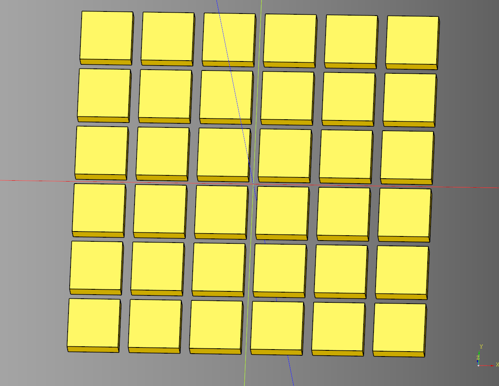

# Wall Documentation

## TileGenerator
Wall tile generator inherits from [Base](https://github.com/medicationforall/cadqueryhelper/blob/main/src/cadqueryhelper/Base.py) class.

### parameters
* length: float
* width: float
* tile_length: float
* tile_width: float
* tile_height: float
* tile_padding: float
* overflow: float
* make_tile_method: Callable[[float, float, float], cq.Workplane]

``` python
import cadquery as cq
from cqfantasy.wall import TileGenerator

def make_basic_tile(
    length:float, 
    width:float, 
    height:float
) -> cq.Workplane:
    tile = cq.Workplane("XY").box(
        length, 
        width, 
        height
    )
    return tile

bp_tiles = TileGenerator()

bp_tiles.length = 75
bp_tiles.width = 75
bp_tiles.tile_length = 10
bp_tiles.tile_width = 10
bp_tiles.tile_height = 3
bp_tiles.tile_padding = 1
bp_tiles.overflow = 0
bp_tiles.make_tile_method = make_basic_tile

bp_tiles.make()

tiles = bp_tiles.build()

show_object(tiles)
```



* [source](../src/cqfantasy/wall/TileGenerator.py)
* [example](../example/wall/tile_generator.py)
* [stl](../stl/wall_tile_generator.stl)


