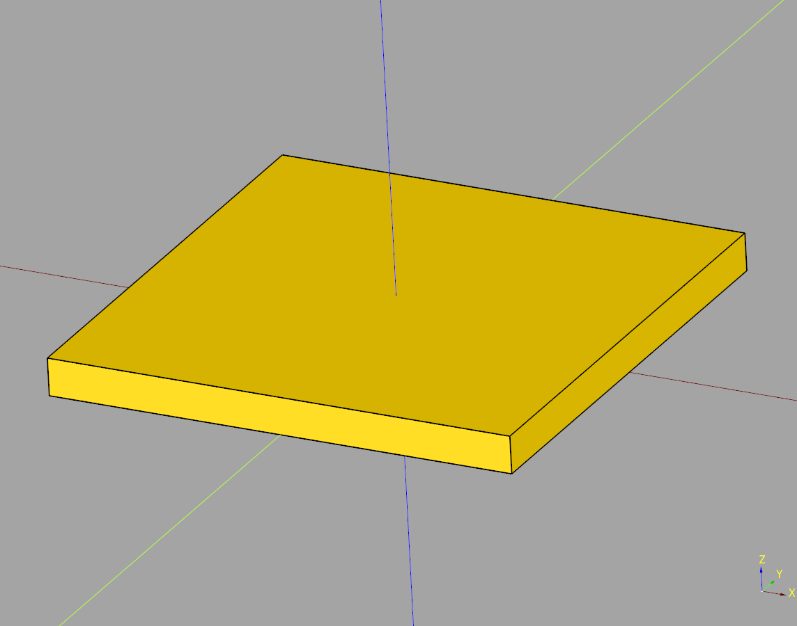
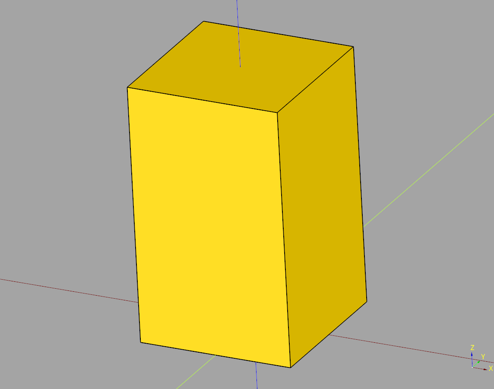
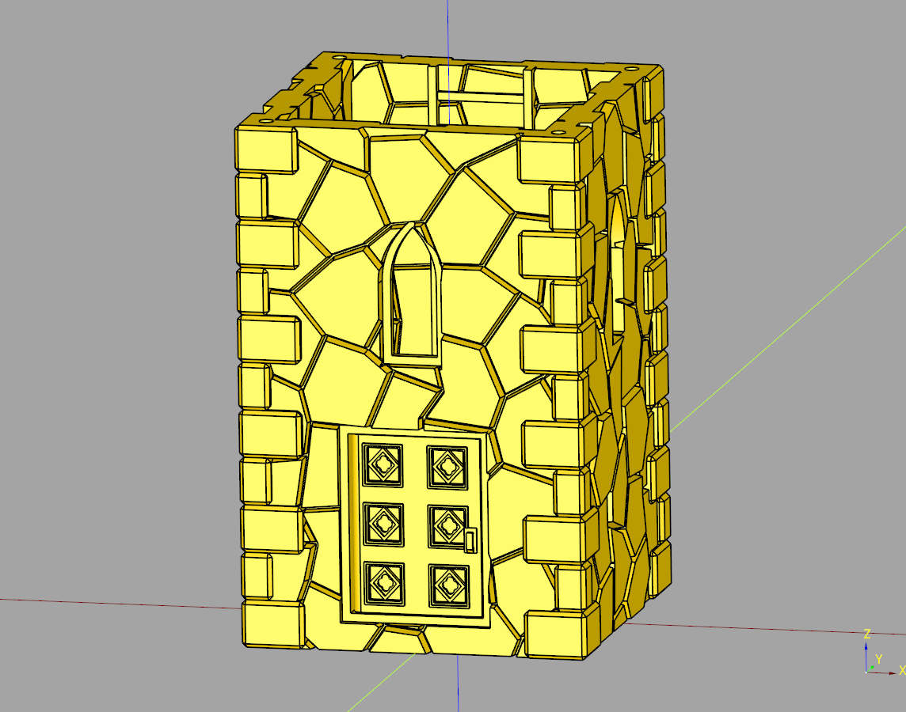
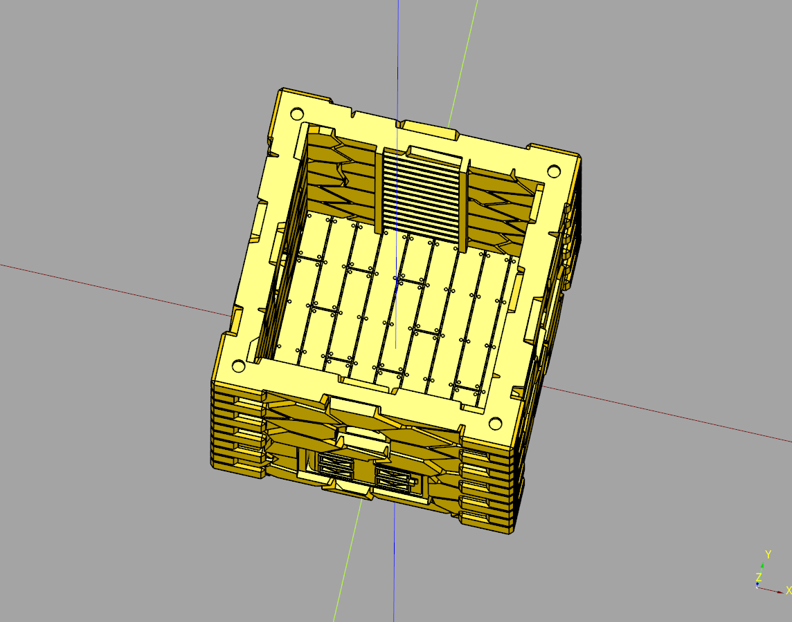
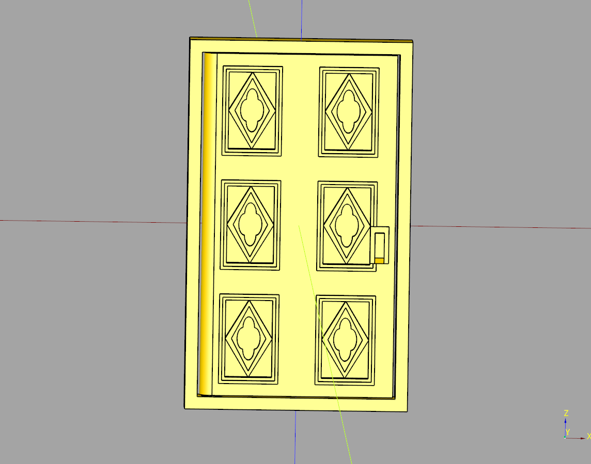
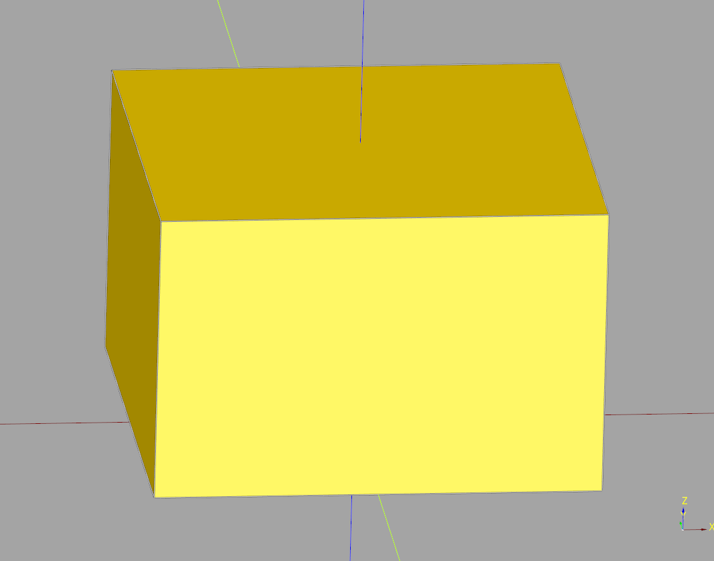
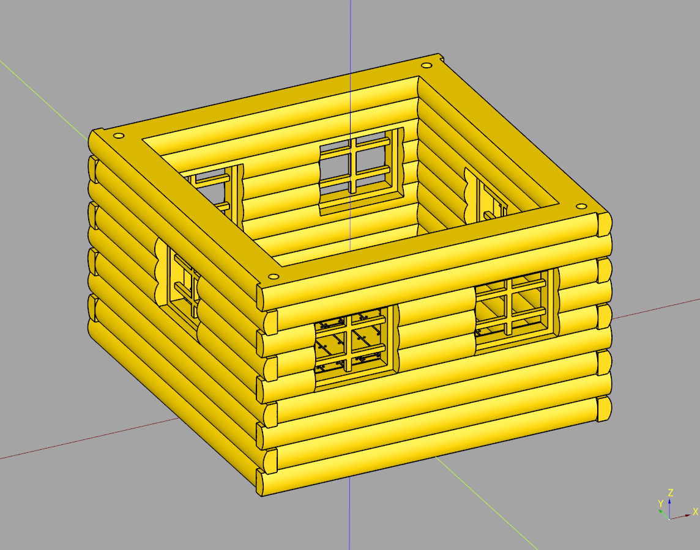
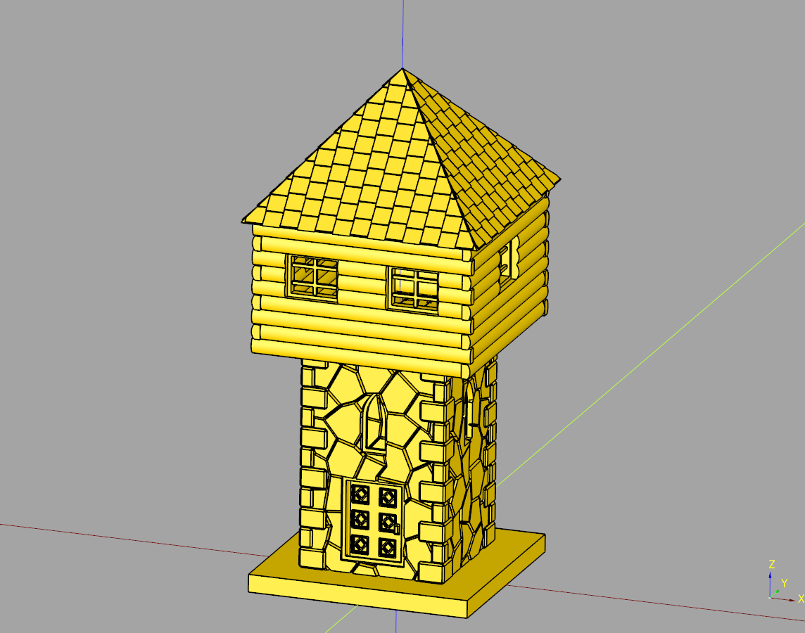

# Watchtower Documentation

---
## Index
* [Tower Base](#tower-base)
* [Tower Body](#tower-body)
* [Tower Body Greebled](#tower-body-greebled)
* [Tower Door](#tower-door)
* [Tower Top](#tower-top)
* [Tower Top Greebled](#tower-top-greebled)
* [Watch Tower](#watch-tower)

---

## Tower Base

### parameters
* length: float
* width: float
* height: float

``` python
import cadquery as cq
from cqfantasy.watchtower import TowerBase

bp_base = TowerBase()
bp_base.length = 125
bp_base.width = 125
bp_base.height = 10
bp_base.make()

ex_base= bp_base.build()

show_object(ex_base)
```



* [source](../src/cqfantasy/watchtower/TowerBase.py)
* [example](../example/watchtower/tower_base.py)
* [stl](../stl/watch_tower_base.stl)

---

## Tower Body

### parameters
* length: float
* width: float
* height: float

``` python
import cadquery as cq
from cqfantasy.watchtower import TowerBody

bp_body = TowerBody()
bp_body.length = 75
bp_body.width = 75
bp_body.height = 125
bp_body.make()

ex_body = bp_body.build()

show_object(ex_body)

```



* [source](../src/cqfantasy/watchtower/TowerBody.py)
* [example](../example/watchtower/tower_body.py)
* [stl](../stl/watch_tower_body.stl)

---

## Tower Body Greebled

### parameters
* length: float
* width: float 
* height: float
* render_doors: bool
* render_windows: bool
* render_outside_walls: bool
* render_inside_walls: bool
* render_floor_tiles: bool
* render_outside_corners: bool
* render_ladder: bool
* render_door_cross_section: bool
* seed: str
* ladder_translate: float
* door_height: float
* door_pivot_height: float
* window_offset:float
* door_rotate: float

### blueprints
* bp_tower: Base = House()
* bp_ladder: Base = Ladder()

``` python
import cadquery as cq
from cqfantasy.watchtower import TowerBodyGreebled

bp_body = TowerBodyGreebled()
bp_body.length = 75
bp_body.width = 75
bp_body.height = 125

bp_body.render_doors = True
bp_body.render_windows = True
bp_body.render_outside_walls = True
bp_body.render_inside_walls = True
bp_body.render_floor_tiles = True
bp_body.render_outside_corners = True
bp_body.render_ladder = True
bp_body.make()

ex_body = bp_body.build()

show_object(ex_body)
```

<br />


* [source](../src/cqfantasy/watchtower/TowerBodyGreebled.py)
* [example](../example/watchtower/tower_body_greebled.py)
* [stl](../stl/watch_tower_body_greebled.stl)

---

## Tower Door

### parameters
* length: float
* width: float
* height: float
* door_width: float
* frame_width: float
* pivot_height: float
* rotate: float
* render_cross_section: bool

### blueprints
* bp_door: base = SimpleDoor()

``` python
import cadquery as cq
from cqfantasy.watchtower import TowerDoor

bp_door = TowerDoor()
bp_door.make()
ex_door = bp_door.build()
ex_cross = bp_door.build_cross_section()

show_object(ex_door)
#show_object(ex_cross)
```



* [source](../src/cqfantasy/watchtower/TowerDoor.py)
* [example](../example/watchtower/tower_door.py)
* [stl](../stl/watch_tower_door.stl)

---

## Tower Top

### parameters
* length:float
* width: float
* height: float

``` python
import cadquery as cq
from cqfantasy.watchtower import TowerTop

bp_top = TowerTop()
bp_top.length:float = 115
bp_top.width:float = 115
bp_top.height:float = 75
bp_top.make()

ex_top = bp_top.build()

show_object(ex_top)
```



* [source](../src/cqfantasy/watchtower/TowerTop.py)
* [example](../example/watchtower/tower_top.py)
* [stl](../stl/watch_tower_top.stl)

---

## Tower Top Greebled

### parameters
* length: float
* width: float
* height: float
* render_floor_tiles: bool
* render_inside_walls: bool
* render_outside_walls: bool
* render_windows: bool

### blueprints
* bp_house = House()

``` python
import cadquery as cq
from cqfantasy.watchtower import TowerTopGreebled

bp_top = TowerTopGreebled()
bp_top.length:float = 115
bp_top.width:float = 115
bp_top.height:float = 75
bp_top.render_doors = True
bp_top.render_windows = True
bp_top.render_outside_walls = True
bp_top.render_inside_walls = True
bp_top.render_floor_tiles = True
bp_top.make()

ex_top = bp_top.build()

show_object(ex_top)
```



* [source](../src/cqfantasy/watchtower/TowerTopGreebled.py)
* [example](../example/watchtower/tower_top_greebled.py)
* [stl](../stl/watch_tower_top_greebled.stl)

---

## Watch Tower

### blueprints
* bp_base = TowerBase()
* bp_body = TowerBodyGreebled()
* bp_top = TowerTopGreebled()
* bp_roof = PyramidRoofShingle()

``` python
import cadquery as cq
from cqfantasy.watchtower import WatchTower

bp_tower = WatchTower()
bp_tower.make()

ex_tower = bp_tower.build()
#ex_cut = bp_tower.build_cut()
#show_object(ex_tower.cut(ex_cut))

show_object(ex_tower)
```



* [source](../src/cqfantasy/watchtower/WatchTower.py)
* [example](../example/watchtower/watch_tower.py)
* [stl](../stl/watch_tower.stl)

---
