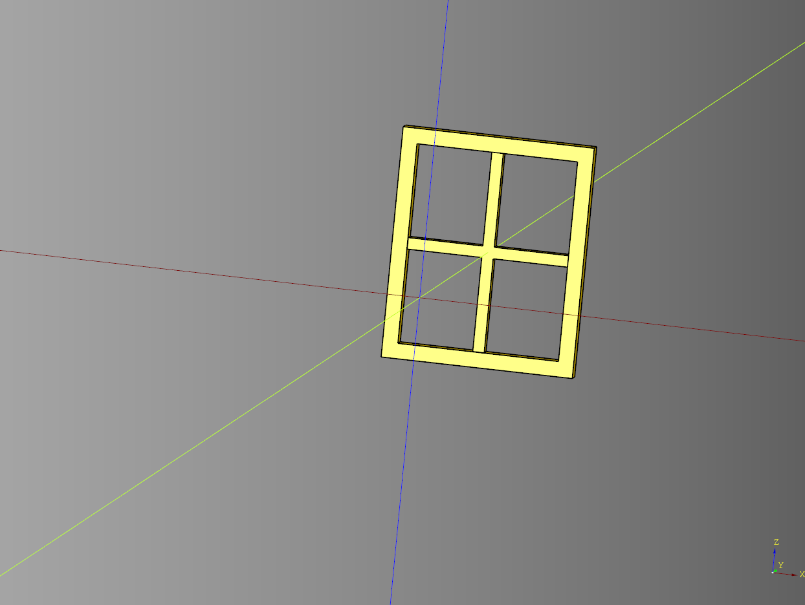

# Window

---

## Casement Window

## parameters
* length: float = 25
* width: float = 2
* height: float = 30
* inner_height_margin: float = 15
* render_cylinder: bool = True
* outside_diameter: float = 130
* inside_diameter: float = 100
* alt_cut_width: width = 10
* frame_width: float = 2
* frame_margin: float = 2
* frame_columns: int = 2 
* frame_rows: int = 3
* grill_width: float = 1 
* grill_height: float = 1


``` python
import cadquery as cq
from cqfantasy.window import CasementWindow

bp_window = CasementWindow()
bp_window.length = 25
bp_window.width = 2
bp_window.height = 30
bp_window.inner_height_margin = 15
bp_window.frame_columns = 2 
bp_window.frame_rows = 2
bp_window.frame_width=2 
bp_window.grill_width=1.5
bp_window.grill_height=1.5

bp_window.frame_width = 2
bp_window.frame_margin = 2
bp_window.render_cylinder = True
bp_window.make()

window = bp_window.build()
window_cut = bp_window.build_cut()

show_object(window)
```



* [source](../src/cqfantasy/window/CasementWindow.py)
* [example](../example/window/casement_window.py)
* [stl](../stl/window_casement_window.stl)

---
